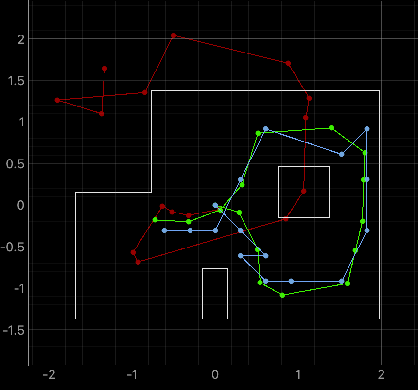
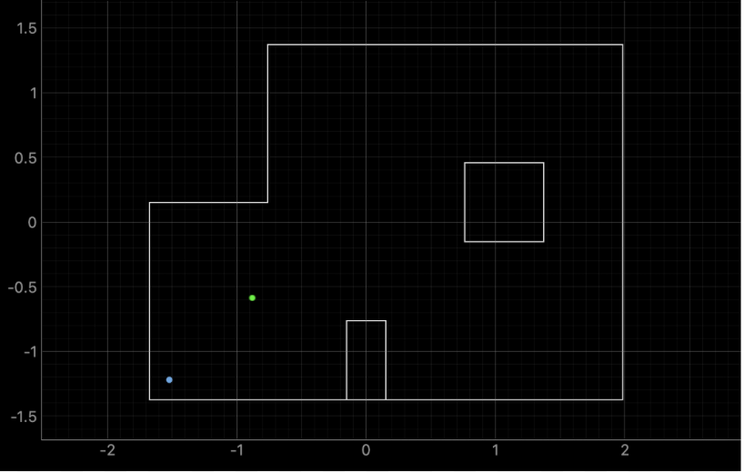
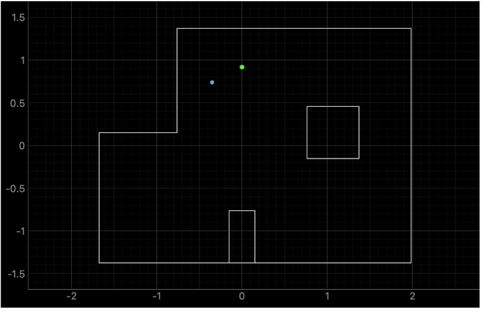
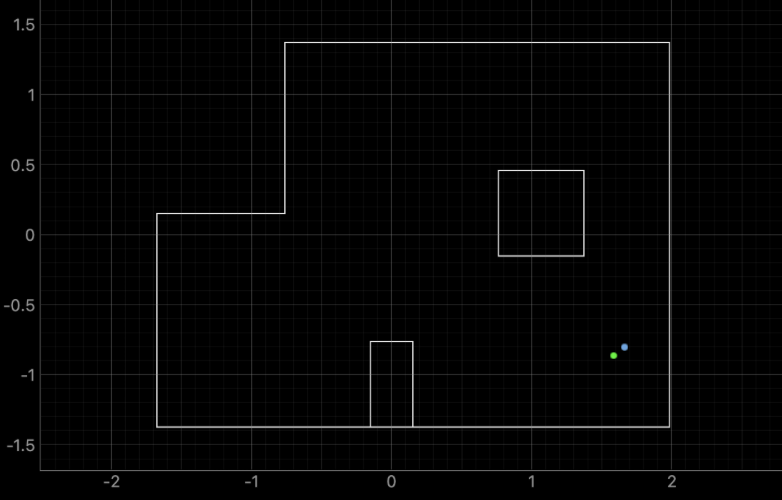
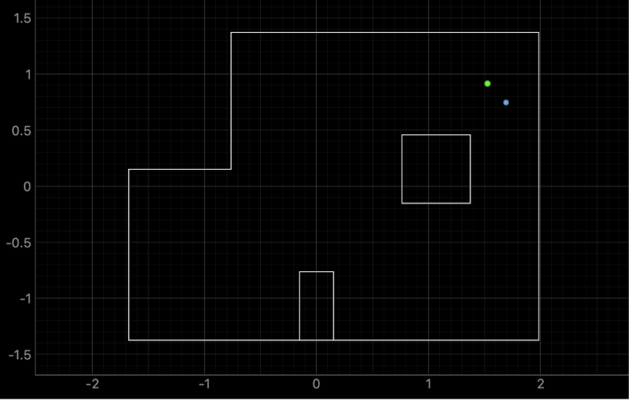

# Lab 11 Overview:
In this lab, I learned how to move ```Lab 10's``` Bayes Filter from sim-to-real and use it localize my car in the given world environment. This was achieved using the PID Rotation Control from ```Lab 7``` and ToF Spin Action from ```Lab 9```.

````Final Wordcount: 999```

## Test Localization in Simulation
Building off of the Bayes Filter implemented in ```Lab 10```, I reimplemented it in the provided ```Lab11_sim``` python notebook. Shown below is the output from this test



As expected, the localization worked much better (i.e. had less error to the ground truth) in areas with a more unique surrounding area such as the righthand corridor and open space in the center top. Comparing this to my ```Lab 10``` results I can see very similar results, which means that my implementation was consistent across these Labs! With this set, I moved towards implementing this in the real-world.

## Robot Localization in Environment
#### Robot Repair
When moving into the real world, I had to fix the issue with my car not properly moving that arose in ```Lab 9```. After completely disassembling my car, I found that both drive trains had debris stuck in them causing interference and gear lock. After removing these, cleaning the the gears, and spraying them with WD-40 they worked great! Shown below is the full spin implementation working on my robot

<div style="text-align: center;">
  <video width="640" height="480" controls>
    <source src="/figures/11_lab/11_2a.mp4" type="video/mp4">
  </video>
</div>

#### Code Implementation
With this fixed, I moved towards the code implementation in ```perform_observation_loop``` shown below:
```python
    def perform_observation_loop(self, rot_vel=120):

        self.ble.start_notify(self.ble.uuid['RX_STRING'], notify_handler)
        self.ble.send_command(CMD.MAP, "20|0.35|0.05|0.0275|0")
    
        t0 = time.time()
        while not done and (time.time() - t0) < 60.0:
            time.sleep(0.01)
            
        LOG.info("Collected Data")
        
        self.ble.stop_notify(self.ble.uuid['RX_STRING'])
        yaw   = np.array(dmp_yaw_data, dtype=float)
        tof_f = np.array(tof1_data,    dtype=float)
    
        yaw_unwrapped = np.unwrap(np.deg2rad(yaw))
        yaw_rel_deg = np.rad2deg(yaw_unwrapped-yaw_unwrapped[0])                  
        yaw_rel_deg   = np.mod(yaw_rel_deg, 360.0)
    
        target_angles = np.arange(0, 360, 18, dtype=float)
        ranges_mm     = np.empty(20, dtype=float)
        for i, tgt in enumerate(target_angles):
            d = np.abs((yaw_rel_deg - tgt + 180.0) % 360.0 - 180.0)
            ranges_mm[i] = tof_f[np.argmin(d)]
    
        sensor_ranges   = ((ranges_mm / 1000.0)*3.28084)[np.newaxis].T 
        sensor_bearings = target_angles[np.newaxis].T
        return sensor_ranges, sensor_bearings

```

For this function, I utilized my previous ```Lab 9``` MAP case in order to turn with some degree increment and take ToF data. Unlike most student examples, however, my MAP is constantly takin in ToF data while running. Thus, although my robot does turn in n degree increments so it can measure at these increments, I do stream back a large array of data to work with afterwards to ensure that my data is not noisy. Thus, once I receive all data after performing the movement, I have a small ```for``` loop to find what data best matches the degree shifts and log that ToF data. I then pass this data as ```sensor_ranges``` and ```sensor_bearings```.

With this implemented, I began testing my robot in the environment to see how well my implementation worked.

#### Real World Testing & Issues
When running my robot in the real world I had three main issues:
1. PID had to be retuned for new surface
2. Battery depletion affecting performance 
3. ToF sensors inaccurate readings

For my first issue, my original tuned PID values of ```0.6, 0.006, 0.025``` worked very well for the lab table's in both the main lab and my research lab. The floor of the world, however, was much more slick and led to some slipping due to the higher speed my robot at was running at compared to ```Lab 9```. This took some time to find the new values of ```0.35, 0.05, 0.0275``` that minimized drift/slipping. This value, however, was a reflection of my battery running at **3.6V** as it was constantly draining after 3-4 runs and required recharging (as no other additional battery was available). 

This leads me to my 2nd problem, where my battery drained very quickly leading to inconsistent results. This meant I had to constantly change my PID values to account for this lower power as well as denote when it was too low power. This state prevented data from being being able to reach a point where it can send over BLE effectively. Shown below is an example where my robot slowed down and crashed due to insufficent power:
<div style="text-align: center;">
  <video width="640" height="480" controls>
    <source src="/figures/11_lab/11_2b.mp4" type="video/mp4">
  </video>
</div>

My final 3rd problem was my ToF sensors sometimes not reading data correctly. Because the Bayes Filter is dependent on these reading, the environment converge to a probability of 0.5 (which means you know really nothing about your system) and would state the robot was outside the world. In other instances, my ToF was too low pointing and lead the Bayes Filter to believe it was inside the top-right box in the environment. Shown below are examples of both of these instances:
<div style="text-align: center;">
  <video width="640" height="480" controls>
    <source src="/figures/11_lab/11_2c.mp4" type="video/mp4">
  </video>
</div>
<div style="text-align: center;">
  <video width="640" height="480" controls>
    <source src="/figures/11_lab/11_2d.mp4" type="video/mp4">
  </video>
</div>

After tuning my PID, accounting for my battery, and fixing/readjusting my ToF sensors I finally had decent results! I also decreased my reading increment from 20° to 18° to have more data for my filter to interpret from.

Note: Error may be affected by physical moving of world in lab due to students bumping the world around during my testing. I tried my best to fix this, but it still may have had an affect.

## Results
Shown below, in order, are the results and discussion for my robot running my Bayes implementation for the points:
1. (-3 ft ,-2 ft ,0 deg)
2. (0 ft,3 ft, 0 deg)
3. (5 ft,-3 ft, 0 deg)
4. (5 ft,3 ft, 0 deg)

#### Location (-3,-2)
For point 1, here is a video of my car running Bayes correctly and reaching some result (Blue is estimate, green is ground truth):

<div style="text-align: center;">
  <video width="640" height="480" controls>
    <source src="/figures/11_lab/11_3a.mp4" type="video/mp4">
  </video>
</div>


I believe a good component of this inaccuracy was my higher sensor_noise value, after lowering this value my results henceforth were much more reasonable. 

#### Location (0,3)

This location had a larger error compared to my other results, which I believe comes down to the non-uniqueness of the location and the amount of readings that require Far readings (which are susceptible to noise).

#### Location (5,-3)

Due to the uniqueness of the location (two orthogonal, non-boundary walls in close proximity), this area was much easier for the Filter to converge towards especially since it had less noisy data to deal with.

#### Location (5, 3)

Similar to (5,-3) this position also had error due to the long corridor under it (i.e. non-unique position) that is hard to differ due to the angular readings in the environment.

## Discussion
In this lab, I learned how what we used in ```Lab 7,9, and 10``` can be used to localize your robot in a given environment using the given beliefs and readings in the real world. I had some difficulty retuning my robot's PID according to the battery level and ensuring my readings were correct when passed to the Bayes, but after much, much effort eventually overcame it. I am excited to wrap this altogether into one cohesive bow with the Motion Planning test in ```Lab 12```

[back](./)
````
