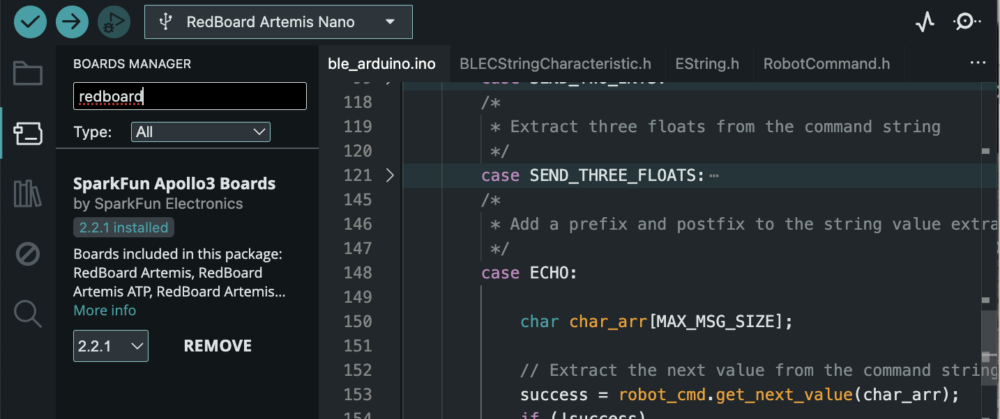
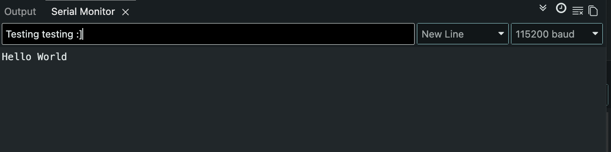
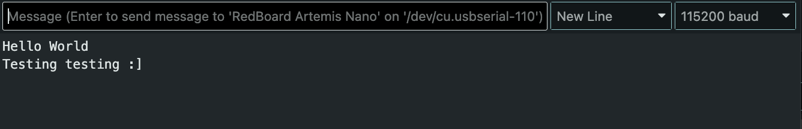
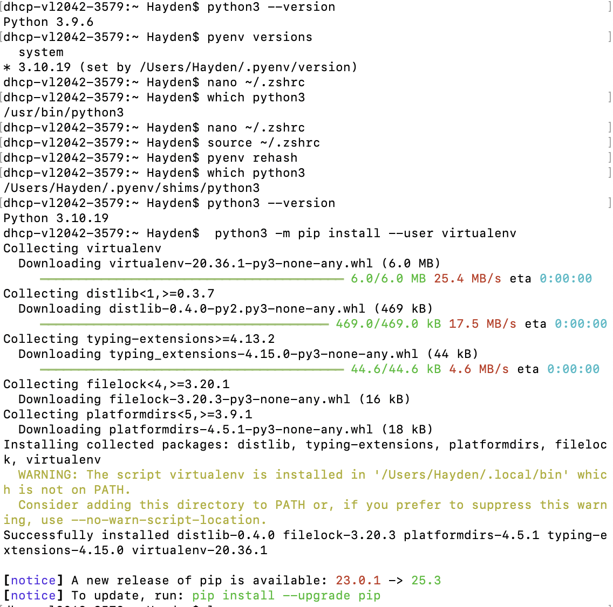
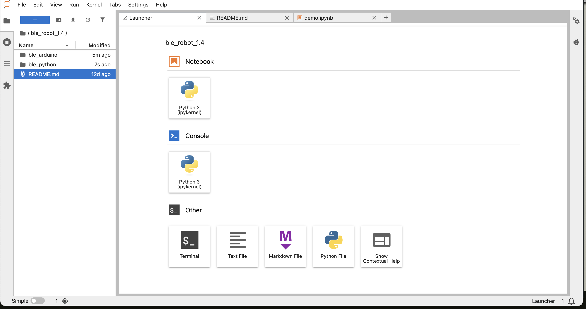
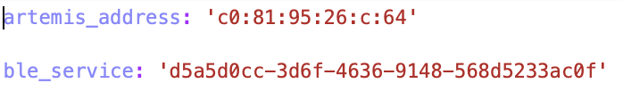
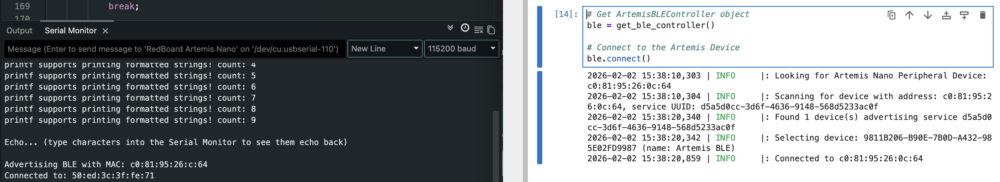
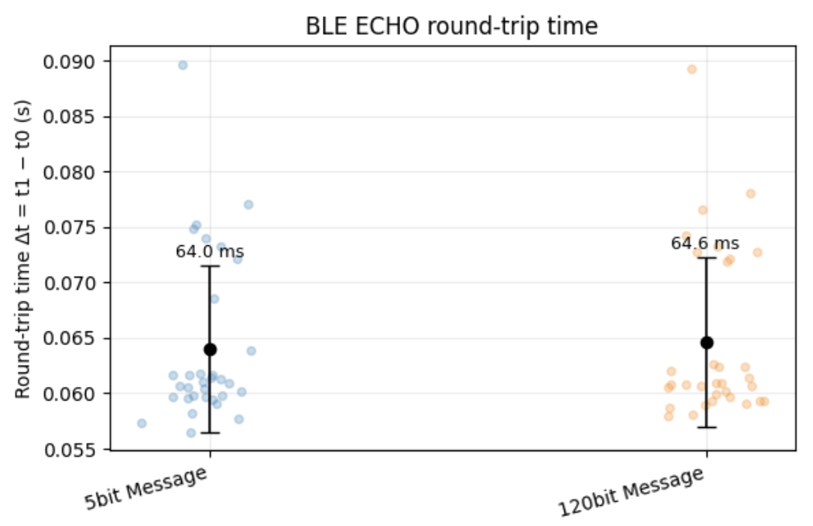

# Lab 1 Overview:
In this lab, I explore how to both set-up & use a SparkFun RedBoard Artemis Nano (or Artemis henceforth). In this, I go through the device's setup and basic features in 1a and explore the limits of wireless connection in 1b. Written below are my details behind both sections, and more info on the Artmeis can be found [here](https://learn.sparkfun.com/tutorials/hookup-guide-for-the-sparkfun-redboard-artemis-nano/all). All work was done on a 2020 M1 Macbook. 
```Final Wordcount: ???```

## Lab 1a Writeup

#### Pre-Lab

For this pre-lab, the only requirement was to install the Arduino IDE. I already had this installed, so there is no figure given but I will show its use for the duration of this write-up.

#### Task 1: Artemis Set-up
I started the lab by first configuring my Artemis in the Arduino environment. In this, I installed the relevant RedBoard Artemis Nano libary (shown here).


#### Task 2: Blink Program
Following this, to validate the connection and library installation I ran the Blink program (found under ```Files -> Examples -> 01.Blink```)at a baud rate of 115200. The shown video demonstrates this:

<div style="text-align: center;">
  <video width="640" height="480" controls>
    <source src="/figures/1_lab/1a_2.mp4" type="video/mp4">
  </video>
</div>


#### Task 3: Serial Program
To test the serial readout of the board, I uploaded the given "Serial" Sketch to the Artemis (found under ```Files->Examples->Apollo3->Example4_Serial```) where it echoed my inputs as shown into the SerialMonitor:



#### Task 4: AnalogRead Program
To next confirm the temperature readouts by the Artemis, I ran the "analogRead" program (Found in ```Files->Examples->Apollo3->Example2_analogRead```) and was able to get out numerous temperature readings on the SerialMonitor:
<div style="text-align: center;">
  <video width="640" height="480" controls>
    <source src="/figures/1_lab/1a_4.mp4" type="video/mp4">
  </video>
</div>>

#### Task 5: Microphone Output
Finally, to confirm that my Artmeis' microphone worked I uploaded and tested the "MicorphoneOutput" sketch (Found in ```Files->Examples->PDM```). I whistled two different tones and my microphone was able to determine its frequency as shown:

<div style="text-align: center;">
  <video width="640" height="480" controls>
    <source src="/figures/1_lab/1a_5.mp4" type="video/mp4">
  </video>
</div>>

#### Graduate Extra: Three Note Tuner
Given that I am a graduate student, I was additionally tasked with combining the microphone sketch & Serial sketch to create a three note tuner. To do this, I utilized the previous "PDM" sketch and played three different notes "D", "A", and "G" from an online tuner to find the frequency the device read these notes as. From there I plugged these values in as conditionals into the base PDM sketch to get my tuner to work!
```c++
if (ui32LoudestFrequency > 580 && ui32LoudestFrequency < 586)
  {
    Serial.printf("Megalovania 1st Note (D): %d         \n", ui32LoudestFrequency);
  }
  else if (ui32LoudestFrequency > 430 && ui32LoudestFrequency < 438)
  {
    Serial.printf("Megalovania 2nd Note (A): %d         \n", ui32LoudestFrequency);
  }
  else if (ui32LoudestFrequency > 785 && ui32LoudestFrequency < 793)
  {
    Serial.printf("Megalovania 3rd Note (G): %d         \n", ui32LoudestFrequency);
  }
  else
  {
    Serial.printf("Not Megalovania (Tuned Note), tuned note:%d         \n", ui32LoudestFrequency);
  }
```
This code uses a range of values to ensure that slight noise disturbance doesn't affect its ability to read the value. The video below shows this program working!

<div style="text-align: center;">
  <video width="640" height="480" controls>
    <source src="/figures/1_lab/1a_6.mp4" type="video/mp4">
  </video>
</div>>

Also fun fact, the notes identified are the first three notes used in [Undertale's Megalovania](https://www.youtube.com/watch?v=0FCvzsVlXpQ&list=RD0FCvzsVlXpQ&start_radio=1) (hence the comment readouts).

## Lab 1b Writeup

#### Pre-Lab
For this pre-lab, I had issues switching python versions due to my Mac having python 3.14 installed already. After reconfiguring my device as shown, I went ahead and installed and set-up my virtual environment.



With the virtual environment setup and sourced, I installed the necessary python packages and could now access the jupyter notebook locally using ```jupyter lab``` in terminal to write code with it!


Looking at this codebase, it is a mixture of Python and Arduino functions that handle connecting to, commanding, and passing information/data between the Artemis and your PC. This passing is down using BLE (Bluetooth Low Energy) in order to facilitate low power use data transfer (albeit with smaller data rates).

For the Artemis itself, the data follows a similar structure to ROS where the Artemis acts as a Publisher ("notifier" in this instance) and the PC as a subscriber ("notifiee"). In this, the PC uses a notifcation function that subscribes to data the Artemis pushes out thus allowing data and commands to be sent between one another. As shown later, BLE messages are limited to 150bytes (i.e. 150 characters for the String messages)

#### Configuration
To allow my Artemis to wirelessly connect and send/receieve data from my PC, I needed to configure it to my Mac. After installing the ArduinoBLE, I found my artemis' MAC address & BLE Service UUID (from the given ```ble_arduino.ino``` sketch and ```uuid4()``` command respectively) and updated this in the codebase's BlE service. 



Following this, my Artemis was able  to advertise its MAC correctly and my PC was able to connect to it:



#### Task 1
For Task 1, I modified the ```Echo``` command to append a smiley face, as shown, so that given words would be received as "'String' :)"
```c++
case ECHO:

    char char_arr[MAX_MSG_SIZE];
    (char_arr);
    if (!success)
        return;

    tx_estring_value.clear();
    tx_estring_value.append(char_arr);
    tx_estring_value.append(" :)");
    tx_characteristic_string.writeValue(tx_estring_value.c_str());
    
    break;
```
Shown below is the accompanying python script and its output:
```python
ble.send_command(CMD.ECHO, "HATE. LET ME TELL YOU HOW MUCH I'VE COME TO HATE YOU SINCE I BEGAN TO LIVE. THERE ARE 387.44 MILLION MILES OF PRINTED CIRCUITS IN WAFER THIN LAYERS")
time.sleep(0.5)
s = ble.receive_string(ble.uuid['RX_STRING'])
print(s)

HATE. LET ME TELL YOU HOW MUCH I'VE COME TO HATE YOU SINCE I BEGAN TO LIVE. THERE ARE 387.44 MILLION MILES OF PRINTED CIRCUITS IN WAFER THIN LAYERS :)
```

#### Task 2
For Task 2, we were to develop the ```SEND_THREE_FLOATS``` case so that it would print out floats sent from the PC to the Serial monitor. Using the given python script:
```python
ble.send_command(CMD.SEND_THREE_FLOATS, "9.0|1.3|3.5")
```
And the modified SEND_THREE_FLOAT receives the stirng of values and pulls the next value out the modified String (using | as its seperator) to then output them.
```c++
case SEND_THREE_FLOATS:

    float float_a, float_b, float_c;

    success = robot_cmd.get_next_value(float_a);
    if (!success)
        return;

    success = robot_cmd.get_next_value(float_b);
    if (!success)
        return;

    success = robot_cmd.get_next_value(float_c);
    if (!success)
        return;

    Serial.print("Three Floats: ");
    Serial.print(float_a);
    Serial.print(", ");
    Serial.print(float_b);
    Serial.print(", ");
    Serial.print(float_c);
    
    break;
```
```c++
Three Floats: 9.00, 1.30, 3.50
```

#### Task 3
In order to track time in the program, I added a command ```GET_TIME_MILLIS``` that, when called, uses c++'s millis() function to log time and send it back
```c++
case GET_TIME_MILLIS:
    tx_estring_value.clear();
    tx_estring_value.append("T:");
    tx_estring_value.append((int)millis());
    tx_characteristic_string.writeValue(tx_estring_value.c_str());

    Serial.print("Sent back: ");
    Serial.println(tx_estring_value.c_str());
    break;
```
Then by calling it in Python it dumps the time from start in milliseceonds:
```python
ble.send_command(CMD.GET_TIME_MILLIS, "")
time.sleep(0.5)
s = ble.receive_string(ble.uuid['RX_STRING'])
print(s)
```
```python
T:42022
```

#### Task 4
For this system, in order to create an equivalent to a ROS subscriber (i.e. a notification handler to asychnronously "listen" to data published by the Artemis for storage & transmission)

```python
time_stamps = []
temps_c = []
done = False

def notify_handler(uuid_str, byte_array):
    
    global time_stamps, done

    s = ble.bytearray_to_string(byte_array).strip()
    if not s:
        return

    if s == "DONE":
        done = True
        return

    if s.startswith("T:"):
        t = int(s.split(":", 1)[1])
        time_stamps.append(t)
        
    if s.startswith("D:"):
        t_str, temp_str = s.split(",", 1)
        time_stamps.append(int(t_str[2:]))
        temps_c.append(float(temp_str))

print("Initalized")
```
Shown here it takes in data that fall with some categorizer T/D (Time & Temperature) and stores them in an array for use later. Thus, in the "background" the data can be handled without directly calling it.

#### Task 5
In order to test the capabilities of the notification handler against calling for data, I created the following loop to send, receive, and process data in a given timed loop. 

```python
 while time.time() < t_end:
    ble.send_command(CMD.GET_TIME_MILLIS, "")
    s = ble.receive_string(ble.uuid['RX_STRING'])

    before, sep, after = s.partition(":")
    counter +=1
```
With this, I would do the data processing on the PC side within the loop. In doing so, I ws able to generate the following effective data transfer rate for messaging:
```
Hz:~58.333
Msg/s:~0.017142
```

#### Task 6
For this next task, I utilized the notification handler to receieve the processed data that happened locally on the Artemis. To do so, I created a large data array to hold time data in the Artemis as well as a time tracker: 
```c++
const int max_samples = 500;
unsigned long time_tracker[max_samples];
int time_count = 0;
```

With these in mind, I created a loop that ran for 5 seconds and pushed millis() data to the global array. 

```c++
case SEND_TIME_DATA: {
    time_count = 0;
    unsigned long start_time = millis();

    while ((millis() - start_time) < (unsigned long)max_samples && time_count < max_samples) 
    {
        time_tracker[time_count] = millis();
        time_count++;
    }
```
With this, it then iterated through the array and sent the data out for the notifcation handler to pull from:
```c++
for (int i = 0; i < time_count; i++) 
    {
        tx_estring_value.clear();
        tx_estring_value.append("T:");
        tx_estring_value.append((int)time_tracker[i]);
        tx_characteristic_string.writeValue(tx_estring_value.c_str());
    }

    tx_estring_value.clear();
    tx_estring_value.append("DONE");
    tx_characteristic_string.writeValue(tx_estring_value.c_str());

    break;
}
```

Then to call this, I used the following python script:
```python
ble.start_notify(ble.uuid["RX_STRING"], notify_handler)
ble.send_command(CMD.SEND_TIME_DATA, "")

t0 = time.time()
while not done and (time.time() - t0) < 5.0:
    time.sleep(0.01)

ble.stop_notify(ble.uuid["RX_STRING"])
```
And obtained the following data transfer rate:
```python
Hz:~74.325
Msg/s: 0.013454
```

#### Task 7
Using the framework of ```SEND_TIME_DATA```, I created a secondary global array & loop to track & store temperature data. 
```c++
float temp_tracker[max_samples];
```

With this, anotiher loop was generated to write down both time & temperature after pulling data from the ADCPUN
```c++
case GET_TEMP_READINGS: {
    int time_count = 0;
    unsigned long start_time = millis();

    while ((millis() - start_time) < (unsigned long)max_samples && time_count < max_samples) 
    {

        #ifdef ADCPIN
            int external = analogRead(EXTERNAL_ADC_PIN);
            analogWrite(LED_BUILTIN, external);
        #endif

        time_tracker[time_count] = millis();
        temp_tracker[time_count] = getTempDegC();

        time_count++;
    }
}
```

The data was published with starting of either D/T (Temperature, Time respectively)
```c++
for (int i = 0; i < time_count; i++) {
    tx_estring_value.clear();
    tx_estring_value.append("D:");
    tx_estring_value.append((int)time_tracker[i]);
    tx_estring_value.append(",");
    tx_estring_value.append(temp_tracker[i]);   // EString supports double/float
    tx_characteristic_string.writeValue(tx_estring_value.c_str());
    delay(5);
}
```
Finally, this python script was run to collect the data and store them on the PC as done previously:
```python
time_stamps.clear()
temps_c.clear()
done = False

ble.start_notify(ble.uuid["RX_STRING"], notify_handler)
ble.send_command(CMD.GET_TEMP_READINGS, "")

t0 = time.time()
while not done and (time.time() - t0) < 3.0:
    time.sleep(0.01)

ble.stop_notify(ble.uuid["RX_STRING"])
```

#### Task 8
Looking between each method, there are pros and cons for either method. For the data processing locally, you can analyze data on the fly which gives you better control instantaneously for immediate actions. Hoever, this method is generally slower than the subscriber-publisher method and can lead to lag if rapid movememtns are necessary.

On the other hand, the Artemis data storage is much faster and happens locally to the controller. While this means the Python overhead doesn't have instantaneous control, you can always build this into the Artemis itself. This is only constrained by the relatively low memory of the Artemis, which means that actions that require larger data may not be favorable with this method.

On this, the Artemis has 384kB where there are 1024 bytes per kB. Thus, with 384kB * 1024b/KB = 393,216 8-bits. Furthermore, because the temp/data messages are 4bytes each that means at max 49,152 can be collected without running out of memory!
#### Graduate Extra: Effective Data Rate and Overhead
To determine the data rate effectiveness between 5-byte and 120-byte replies, I used the following loop to send and receive messages:
5-bit - 
```python
while current_time - start_time < 2.0:
    t0_5.append(time.time())
    ble.send_command(CMD.ECHO, "HATE.")
    s = ble.receive_string(ble.uuid['RX_STRING'])
    t1_5.append(time.time())
    current_time = time.time()
```
120-bit - 
```python
while current_time - start_time < 2.0:
    t0_120.append(time.time())
    ble.send_command(CMD.ECHO, "HATE. LET ME TELL YOU HOW MUCH I'VE COME TO HATE YOU SINCE I BEGAN TO LIVE. THERE ARE 387.44 MILLION MILES OF PRINTED CI")
    s = ble.receive_string(ble.uuid['RX_STRING'])
    t1_120.append(time.time())
    current_time = time.time()
```
Using these stored data for sending and receiving data, I averaged the two arrays for both arrays and plotted them:


(ChatGPT was utilized to generate the figure)

In this, we can see that both message sizes have approximately the same time required to send both messages with approximately the same deviation. Knowing this however, we can then determine the overhead size

Using this, we can perform basic math to determine the B/s given (where B/s=size*8/mean):
```python
5-byte reply
  mean deltaT = 64.03 ms, std = 7.53 ms
  effective rate ≈ 78.1 B/s (0.6 kb/s)
120-byte reply
  mean deltaT = 64.62 ms, std = 7.64 ms
  effective rate ≈ 1857.1 B/s (14.9 kb/s
```
Thus, while both take the same approximate amount of time the 120-bit message is able to push a higher amount of data compared to the 5-bit message. This implies that short messages generally produce more overhead and that the cost between sending more data per message is negligible given this fact.

#### Graduate Extra: Reliability
If you're pushing data at a faster rate from the robot to the computer, because of the nature of the notifier (i.e. publisher/subscriber) model data is not lost. Data is sent in a "bulletin-board" style thus while it may not be 1:1 on timing, the transfer is reliable as it essentially queues up data to receieve.

## Discussion
In this lab, I learned how to both set-up/use an Artemis Nano as well as the various data transfer methods using BLE for sending and receiving data between your PC and the board. One of the larger challenges I faced was remembering how to code in c++, I haven't done so in a while and so remembering how to set-up cases & notifiers was tricky. I did become better with time, and by the end was having little to no difficulty writing code. Going forward, I feel more confident about using and implementing BLE as it will come up in the course.

[back](./)