# Lab 2 Overview:
In this lab, I explore how to set up the IMU on the Artemis and transmit data from its gyroscope/accelerometer to my PC (and record a cool stunt on my new robot). All work was done on a 2020 M1 Macbook. 
```Final Wordcount: 998```

## Setting up the IMU

#### Pre-Lab
For this pre-lab, the only requirement was to read on the [Sparkfun IMU](https://www.sparkfun.com/sparkfun-9dof-imu-breakout-icm-20948-qwiic.html). I read through this and was prepared.

#### Task 1/2: Install & Connect
After installing the IMU library, I connected the Artemis to the IMU (as shown) and ran the Example1_Basics (found in ```Example -> ICM20948 -> Arduino -> Example1_Basics```)to learn how to pull data from the IMU.
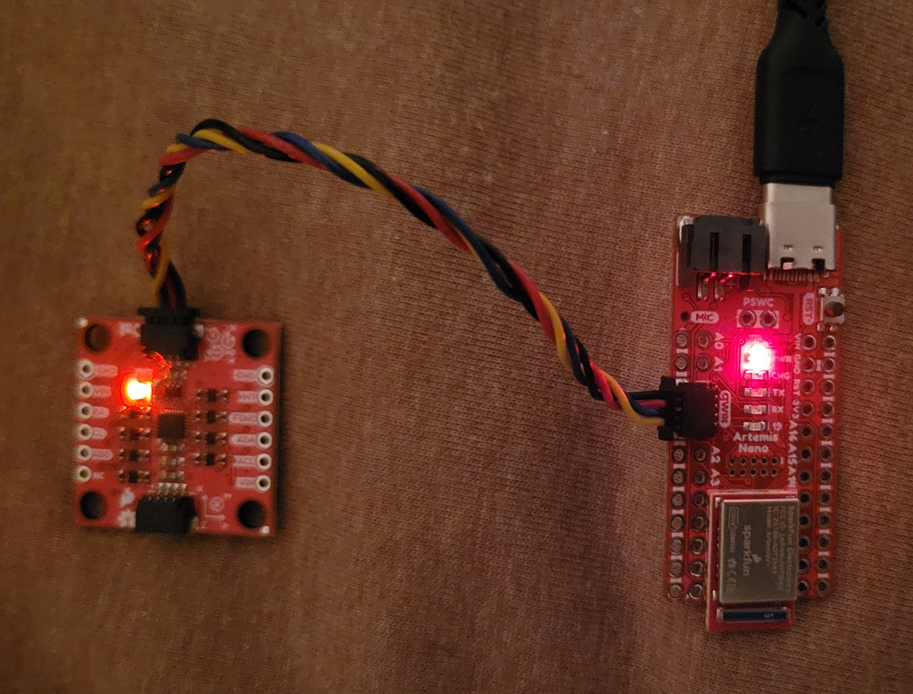

Running the provided sketch, it printed out the differing values of the accelerometer, gyroscope, and thermometer as shown:

<div style="text-align: center;">
  <video width="640" height="480" controls>
    <source src="/figures/2_lab/2_0b.mp4" type="video/mp4">
  </video>
</div>

#### Task 3: Ad0 Pin/Acc & Gyr Discussion
Looking over this example sketch, I noticed that the ```AD0_VAL``` pin was given at 1. After [searching around](https://learn.sparkfun.com/tutorials/sparkfun-9dof-imu-icm-20948-breakout-hookup-guide/all) and playing with the value, I determined that the pin represented the IMU's I2C address last bit and was only needed for the I2C work. Because this lab doesn't use this feature, I left it ```0```.

Furthermore, I noted that the accelerometer's raw values was susceiptible to gravity (As seen in the given video) and would increase when roll/pitch were aligned with the ground. Furthermore, the raw gyroscope value was only a changing value from a state and thus would need integration to pull an actual theta value from (See ```Gyroscope``` section for more.)

#### Task 4: Blink Start-Up
For the final part of this setup, I added a basic blink to my program by swapping HIGH/LOW values in  ```digitalWrite()``` to indicate when the device was finishing its setup.

<div style="text-align: center;">
  <video width="640" height="480" controls>
    <source src="/figures/2_lab/2_0c.mp4" type="video/mp4">
  </video>
</div>

## Accelerometer

#### Task 1: Roll & Pitch Outputs
In order to convert the accelerometer's given acceleration components, I used c++'s ```atan2``` as shown to derive roll & pitch (in degrees) from x/y (acrtan) and y/z as shown in the equaton below. 

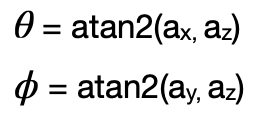

```c++
acc_roll = (atan2(myICM.agmt.acc.axes.x, myICM.agmt.acc.axes.z))*(180/M_PI);
acc_pitch = (atan2(myICM.agmt.acc.axes.y, myICM.agmt.acc.axes.z))*(180/M_PI);
```
Using my BlE environment from Lab 1 (More discussion on this in ```Sample Data```), I pulled data from over a period of 10s and plotted them (Image style from [Stephan Wagner](https://fast.synthghost.com/lab-2-inertial-measurement-unit/)).

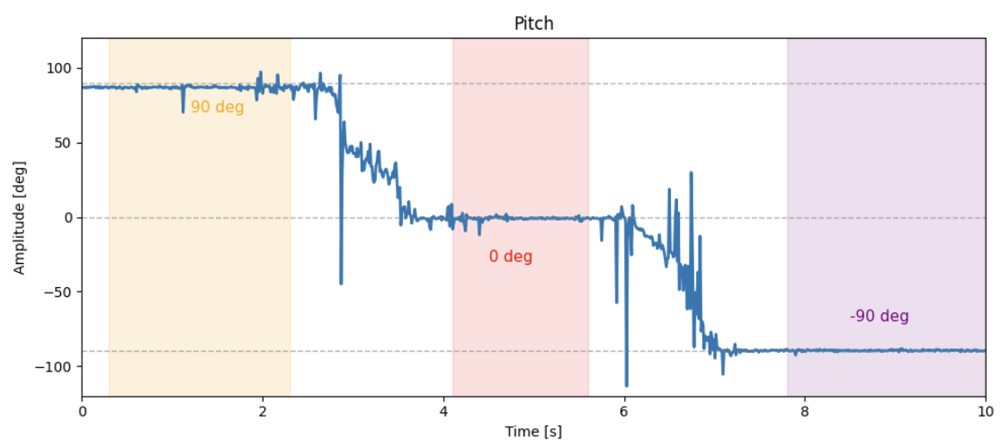
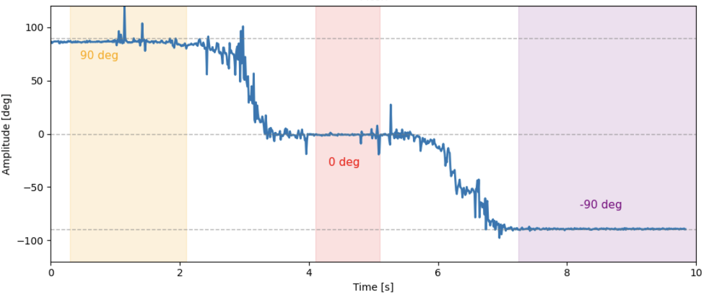

Looking at this, the information seems to pretty accurate to the 90,0,-90 degrees I set it to outside of noise & thus did not need further calibration.

#### Task 2: Fourier Transform

As mentioned previously, the accelerometer is pretty noisy, and so I performed a Fourier transform on it using ```fft()``` from SciPy (Data was taken at rest with small bumps on table):

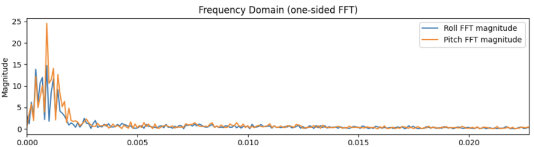

 In this, we can see that frequency from the accelerometer for roll & pitch is turns to noise is ~5Hz and thus I used that value for my low pass filter (as seen in the next task).

#### Task 4: Low-Pass Filter
For this task, I needed to implement a low-pass filter to account for noise in the accelerometer. To do so, I used the given equations where ```alpha = T/(T+(1/(2pi*1/fc)))```: 

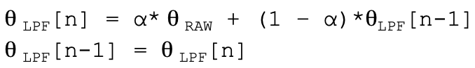

With a sampling period of 11ms and cutoff frequency of 5Hz, I was able to get the following rejection to disturbances (i.e. bumps on the table):

Code - 
```python
for i in range(1, len(roll)):
    LPF_roll[i] = alpha*roll[i] + (1-alpha)*LPF_roll[i-1]
    LPF_roll[i-1] = LPF_roll[i]
```
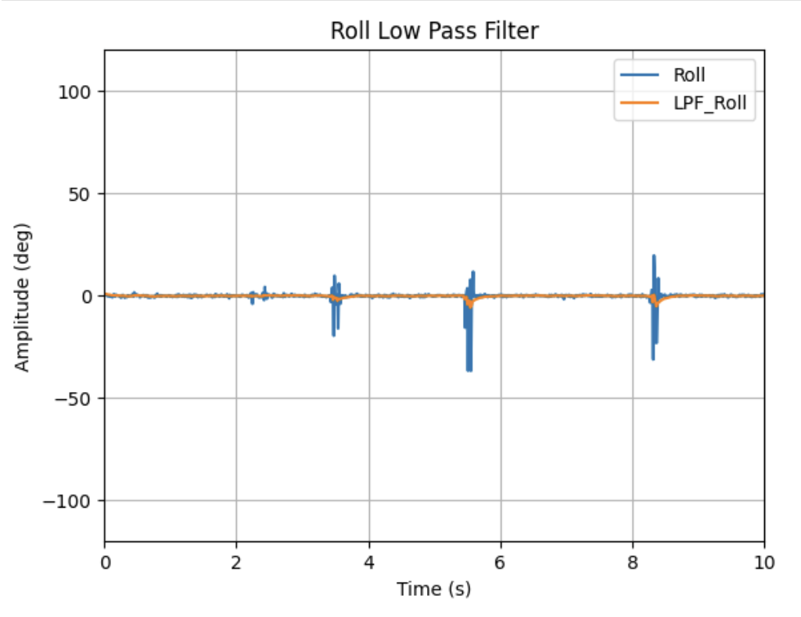

From here, we can see that the Low-Pass filter successfully stabilized from disturbances and showed little to no rises/falls from these bumps than with the raw data.

## Gyroscope

#### Task 1: Roll,Pitch, Yaw Angles
Using the equations below, I was able to find the basic roll,pitch, and yaw values from the gyroscope which integrates for the angle over time:

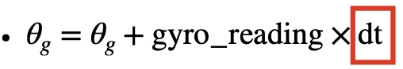

```c++
gyr_roll = gyr_roll + myICM.agmt.gyr.axes.y*(-0.00011);
gyr_pitch = gyr_pitch + myICM.agmt.gyr.axes.x*(0.00011);
gyr_yaw = gyr_yaw + myICM.agmt.gyr.axes.z*(0.00011);
```
Raw Values:
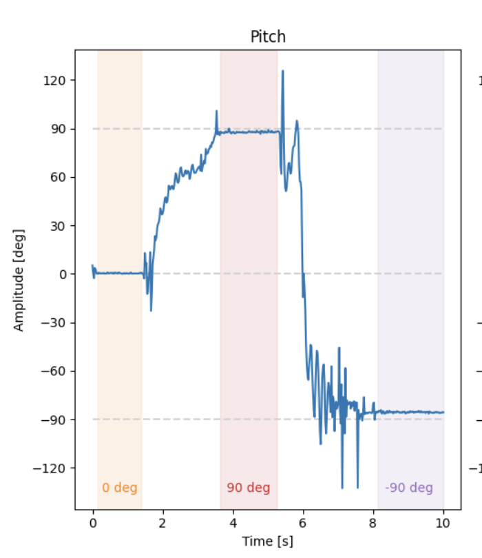


With this, I tested each direction doing movements from 90,0, and -90 degrees and compared them against the accelerometer's values:


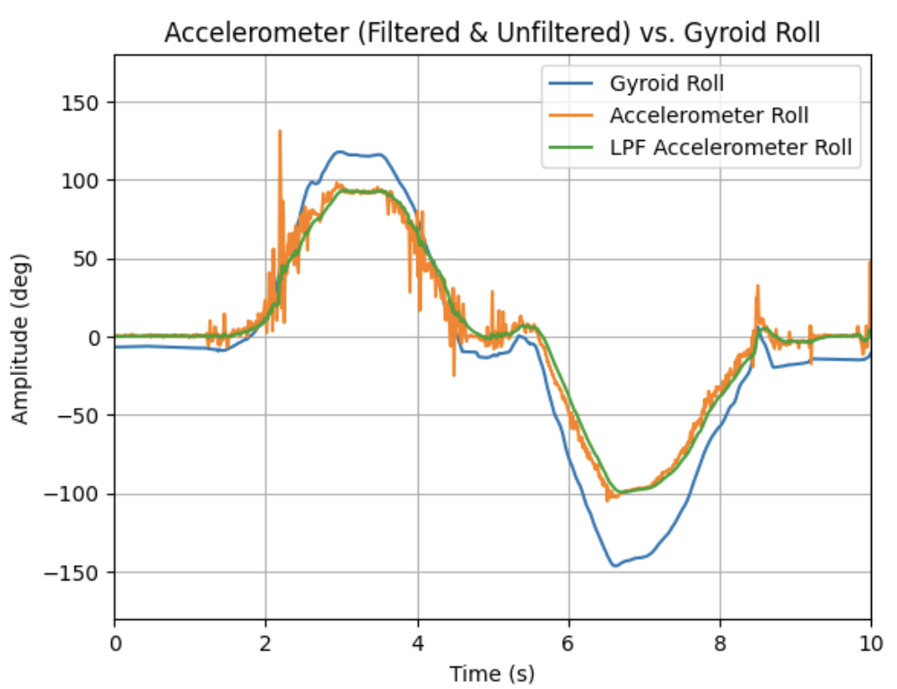

Looking at this, I noted that the gyroscope, while less noisy than the accelerometer, became less accurate in rapid movements or as time went on (i.e. drifted from "ground"). Although higher sampling rates helped this slightly, the accuracy drift still occurred.

#### Task 2: Complementary Filter

In order to create a truly accurate angle estimator, I implemented a complementary filter for roll, pitch, and yaw. As shown in its equaiton, it uses both the gyroscope & filtered accelerometer's values (where alpha is a tuning parameter):

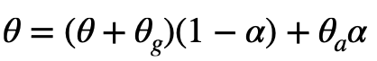

Implementing this, I noticed that the new estimations, as shown, were not susceptible to drift and were much better at rejecting disturbances (bumps, vibrations, etc.). To note, I personally chose a large alpha of ```0.92``` to fight the gyroscope drift, which worked well as seen:

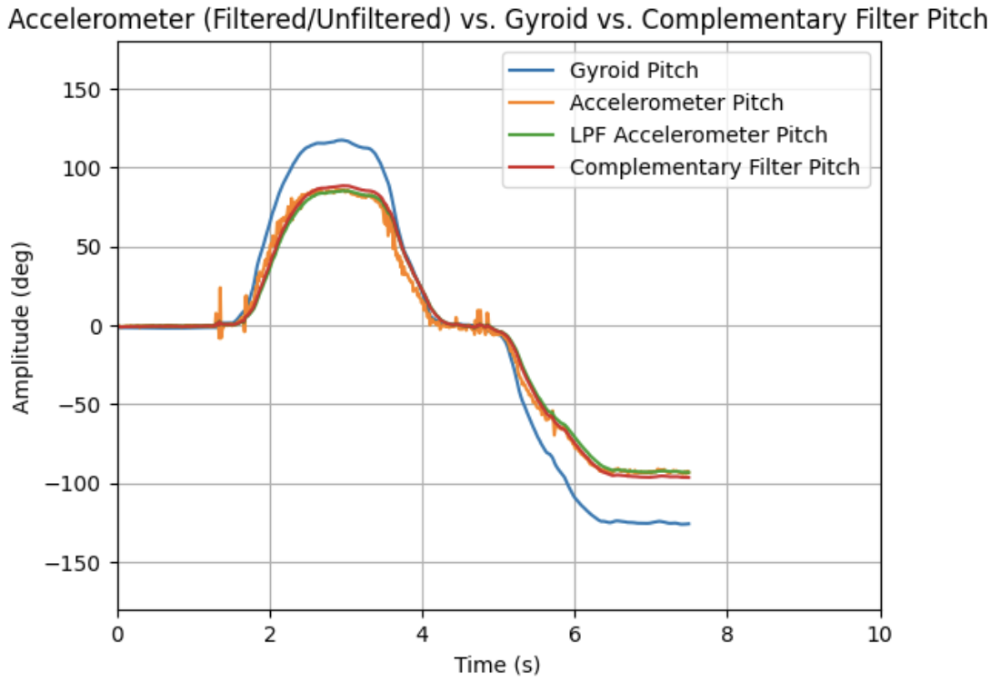
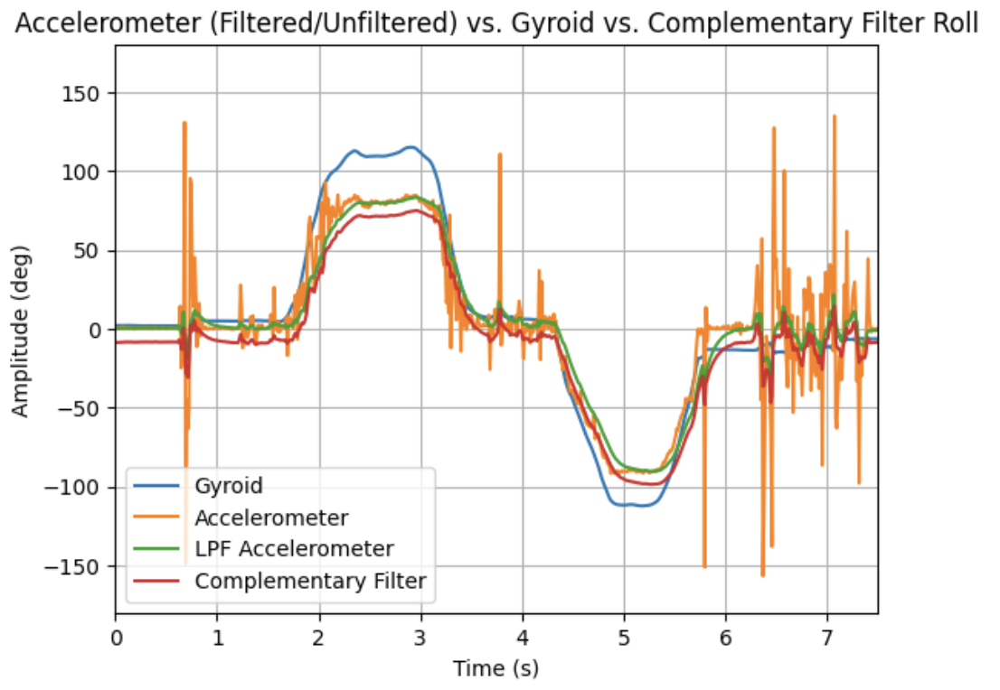


## Sample Data

#### Task 1/2: Speed up Execution
For this section, I implemented the bulk of the IMU calls as a new case in the Lab 1 environmenet. The code follows the same structure as that's ```GET_TEMP_READINGS``` with IMU calls instead of temp-pin calls & similar to global arrays for roll,pitch, and yaw for the accelerometer, gyroscope, and complementary filters. Max_samples was 10000 (10s) for most tests.
```c++
float acc_roll_tracker[max_samples];
float acc_pitch_tracker[max_samples];
float gyr_roll_tracker[max_samples];
float gyr_pitch_tracker[max_samples];
float gyr_yaw_tracker[max_samples];
float com_roll_tracker[max_samples];
float com_pitch_tracker[max_samples];

```
With the logic to run it:
```c++
case IMU_DATA: {

  int time_count = 0;
  unsigned long start_time = millis();

    while ((millis() - start_time) < (unsigned long)max_samples && time_count < max_samples){
      myICM.getAGMT();
      acc_roll = (atan2(myICM.agmt.acc.axes.x, myICM.agmt.acc.axes.z))*(180/M_PI);
      acc_pitch = (atan2(myICM.agmt.acc.axes.y, myICM.agmt.acc.axes.z))*(180/M_PI);

      gyr_roll = gyr_roll + myICM.agmt.gyr.axes.y*(-0.00011);
      gyr_pitch = gyr_pitch + myICM.agmt.gyr.axes.x*(0.00011);
      gyr_yaw = gyr_yaw + myICM.agmt.gyr.axes.z*(0.00011);
      com_roll = (com_roll + gyr_roll)*(1-alpha)+acc_roll*alpha;
      com_pitch = (com_pitch + gyr_pitch)*(1-alpha)+acc_pitch*alpha;`
      }
```
Using this system, I was able to reeach an IMU sampling rate of ~220Hz (Most likely could have been sped up with less variable storage) which is still slower than the Artemis (~45HZ).

#### Task 3/4
As shown in Task 1/2, I used 8 different ```float``` arrays to store roll, pitch, and yaw. This split, while high in memory, let me be able to sort through the data on the jupyter side especially when sending data over (as we saw in Lab 1, doing this reduces message overhead). Moreso, once implemented on the car I can reduce this down to 3 to just encapsulate the complementary filter values.

I choase ```float``` for my data storage as it let me storage up to 32bits of data about my rotation. While not necessary now, having that accuracy will make a difference later with the robot.

Given my sampling rate of ~220Hz and that my float arrays took up ~50% of the memory, I could fill up the memory of ```384kB``` in ~227 seconds or 3.7 minutes.

To show off that my system can run this fast wiht that much data, I logged the roll/pitch for a span of 10s with chanages in amplitude from -90,0 and 90 with disturbances. Shown below are my successful attempts at this!


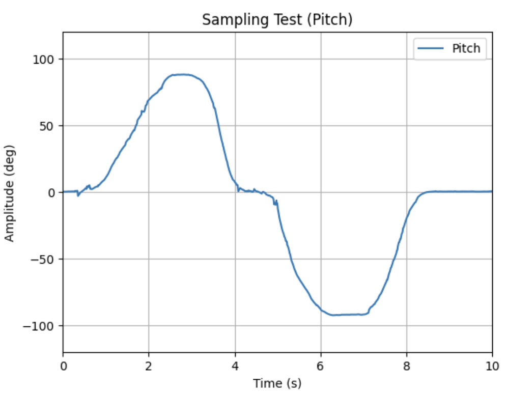

## Record a Stunt
For this last task, I played around with the provided RC car as shown:

<div style="text-align: center;">
  <video width="640" height="480" controls>
    <source src="/figures/2_lab/2_5a.mp4" type="video/mp4">
  </video>
</div>

The car itself is very zippy and is very prone to knocking itself over/sideways due to its fast movements. It also can easily lose its battery cover & have its battery disconnect as shown, which will need to be accounted for in the future.


## Discussion
In this lab, I learned how to set-up/use an IMU with my Artemis Nano. I had some difficulty tuning the complementary filter, but after some trial & error with the alpha value I was able to get it working.

Going forward, I feel more confident about using and implementing BLE as it will come up in the course.

[back](./)