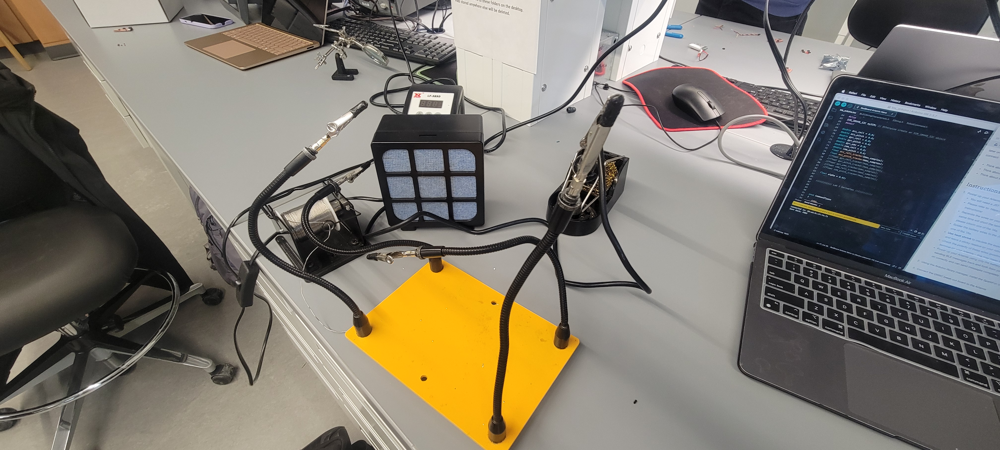
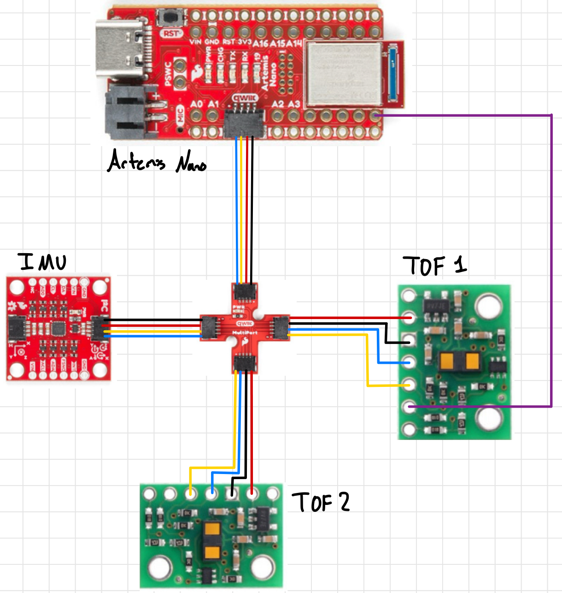
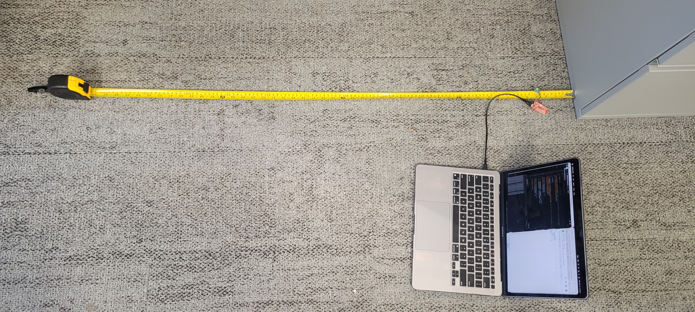
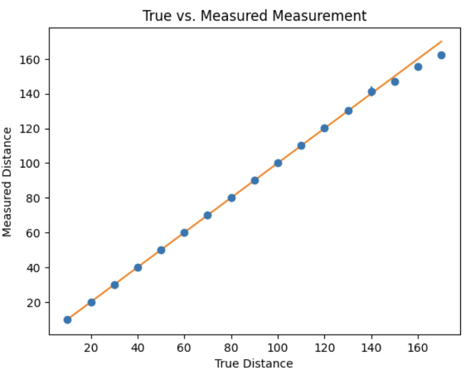
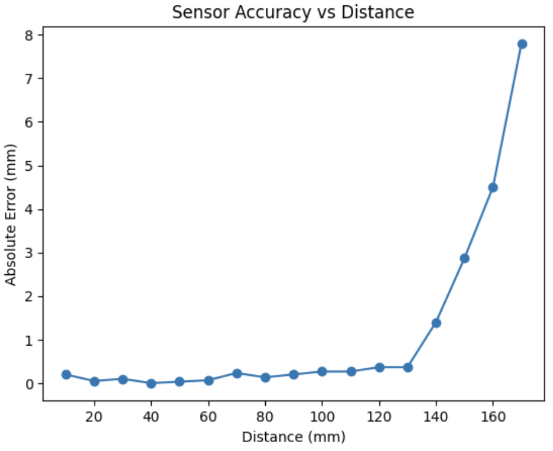
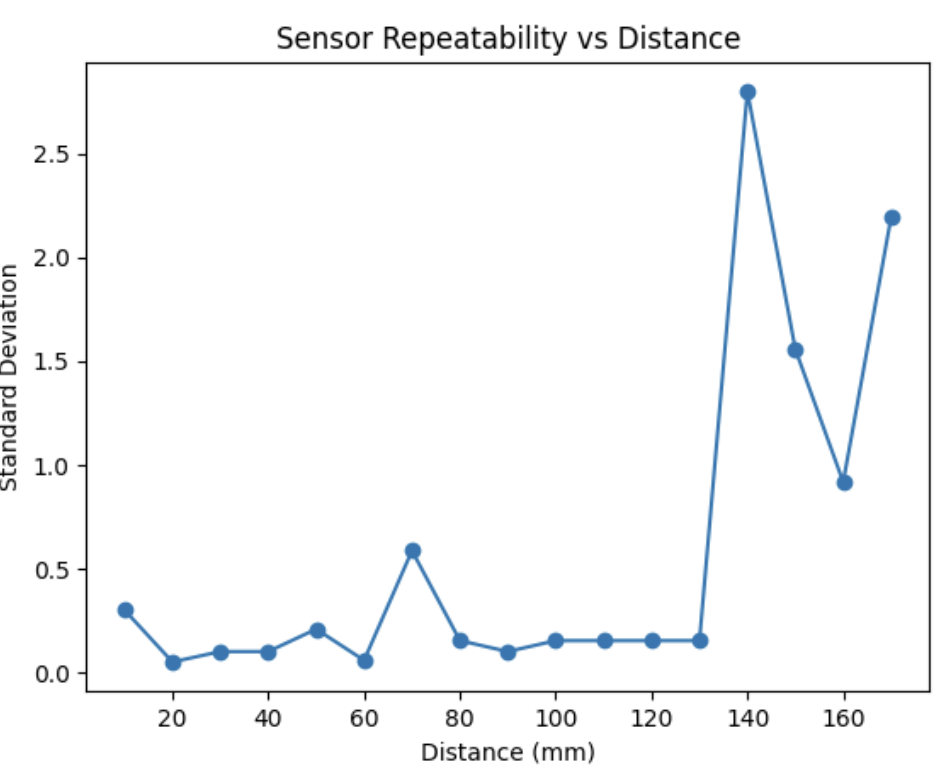
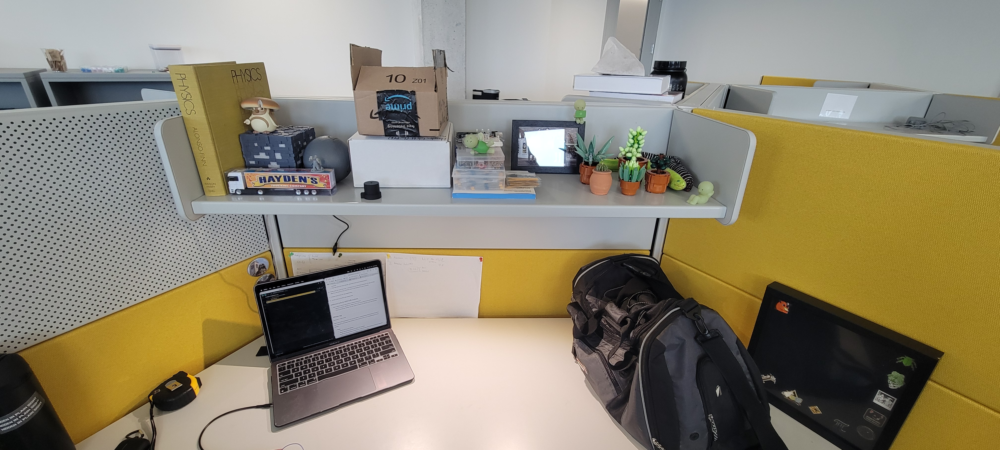

# Lab 2 Overview:
In this lab, I explore how to hook up a battery to power board without tethering. Additionally, I explore how to use the Time of Flight(TOF) sensors (VL53L1X) in parallel as well as setup an I2C bus to interface with them and the previous lab's IMU. All work was done on a 2020 M1 Macbook. 
```Final Wordcount: 976```

## Setting up the TOF Sensors

#### Pre-Lab
For this pre-lab, the only requirement was to read the [manual](https://cdn.sparkfun.com/assets/e/1/8/4/e/VL53L1X_API.pdf) and [datasheet](https://cdn.sparkfun.com/assets/8/9/9/a/6/VL53L0X_DS.pdf) for the TOF sensors. From this, it is important to note that both TOF sensors have the same I2C address, and thus need to be modified to differentiate them when calling. This can be manually set via the bus or over air, wherein I opted via the bus (More on this in ```Task 1```). 

Additionally, because there are only 2 TOF sensors for the car it is important to strategically place them where they can detect the most objects. In this, having one on the front of the car and side is optimal but will lead to one side being effectively "blind". Thus, this should be accounted for in planning to ensure that obstacles on the opposite side are tracked in memory.

#### Task 1: Artemis Battery Power
Following the given instructions, I was able to splice and solder my battery wires to the JST connectors using the following setup:




Shown below is my Artemis running the ```Example: Blink``` sketch untethered as well as a picture of the setup. With ```Lab 2's``` program already running, I was able to send messages to and from the device using BLE.


<div style="text-align: center;">
  <video width="640" height="480" controls>
    <source src="/figures/3_lab/3_1b.mp4" type="video/mp4">
  </video>
</div>


#### Task 2-4: TOF Sensor Setup
Following this, I then soldered the short QWIIC cables to both of my TOF sensors. Using standard nomenclature, the following colors were matched thus:
- ```Red -> VIN```
- ```Black -> GND```
- ```Yellow -> SCL```
- ```Blue -> SDA```
- ```Purple -> XSHUT```

Additionally, I soldered a wire between one TOF sensors ```XSHUT``` pin and ```PIN 8``` as shown. Because I can't set the I2C address over the air and both TOF sensors have the same address (```0x29```), I would need to turn one off, manually set the address permanently for the other, then turn it back on in order to use both. Thus, I'm using ```Pin 8``` as a GPIO to send a HIGH/LOW signal to one TOF sensor's ```XSHUT``` to facilitate the address setup and set the 2nd TOF to ```0x49```. Shown below is the wiring sketch for this lab (including IMU):



Given the geomeotry of the robot, I will most likely need to resolder one TOF's QWIIC cable to be longer so I can reach the front/side of the car. Regardless, shown here are both of my wired TOF sensors connected to the QWIIC multiport as well as them working:


<div style="text-align: center;">
  <video width="640" height="480" controls>
    <source src="/figures/3_lab/3_1e.mp4" type="video/mp4">
  </video>
</div>

#### Task 5: TOF I2C Scanning
Using the ```Wire_I2C``` sketch given (```File->Examples->Apollo3->Wire```), I called the connected IMU sensor and found that the I2C address that was being broadcast was ```0x29``` as shown:


This was surprising as, per the manual, it should be advertising ```0x52```. This is similar to the IMU's I2C bit address issue where the last bit used for reading/writing and is dropped in the address send over. Thus, in binary, the original ```110100``` becomes ```11101``` in the readout.

#### Task 6-7: Sensing Modes
After lookig through the manual and previous students comments on the modes (See [Charlie Mueller](https://pages.github.coecis.cornell.edu/cmm478/ECE4160/Lab3/)) I believe that ```short``` mode is better going forward. The longer ranges being susceptible to light is a large factor that doesn't need to be another variable to account for. Moreso, most obstacles only neeed to be considered once "close" to the robot.

After this decision I began testing out my chosen sensing mode for the TOF sensors (Short, range of 1.3). To test out the accuracy & range of this mode, I used the ```Example1_Read Distance ``` to record data against real measurements as shown in the following experimental setup:



Using the setup, I first tested the ```short``` mode and was able to produce the following graphs (where each sample had periods of lighting changes from light to dark):




In this, we can see that the measurements are reasonably accurate up to the listed range  wherein the error and standard deviation seem to jump dramtically. The error below 1.3m, however, averaged out to be ~1.5-2.0mm which can be improved using a set measuring frame (i.e. not holding the sensor in hand). Important to note that the light changes had no affect on the measured distance.

#### Task 8: Simultaneous TOF Sensor Setup
As mentioned in ```Task 2-4```, the ```XSHUT``` pin on one TOF would need to be written to to turn the device off to set the address to the other TOF sensor. Shown below was this code  (with logic to notify if the TOF sensors didn't initalize):
```c++
#include <Wire.h>
#include "SparkFun_VL53L1X.h"

#define XSHUT 8
#define TOF1_ADDRESS 0x49
SFEVL53L1X TOF1;
SFEVL53L1X TOF2;
...
void setup()
... 
pinMode(XSHUT, OUTPUT);
digitalWrite(XSHUT, LOW);

TOF1.setI2CAddress(TOF1_ADDRESS);
if (TOF1.begin() != 0) {
    Serial.println("TOF1 failed to begin.");
}
else{
    Serial.println("TOF1 Initalized");
}

digitalWrite(XSHUT, HIGH);
if (TOF2.begin() != 0) {
    Serial.println("TOF2 failed to begin.");
    return;
}
else{
    Serial.println("TOF2 Initalized");
}
...
```
Demonstration of this working can be seen in ```Task 10-12```'s video.

#### Task 9: TOF Sensor Frequency Estimation
Using the base ```Example1_ReadDistance``` sketch, I modified the main loop to Serial print out the ```millis()``` time and the TOF data if it was available (using ```checkForDataReady()```) as fast as the Artemis could run:
```c++
void loop()
Serial.println(millis());

if(TOF1.checkForDataReady()){
    Seria.print("Distance (mm) TOF1: ");
    Serial.println(TOF1.getDistance());
}

if(TOF2.checkForDataReady()){
    Seria.print("Distance (mm) TOF2: ");
    Serial.println(TOF2.getDistance());
}
```

Using this, I found that the sampling rate for both sensors was approximately 10.3Hz compared to the Artemis running rate of 230Hz. This means that the TOF sensors run significantly slower compared to both the Artemis and IMU (~220Hz) and can introduce serious lag/lower resolution. It may be better then to skip over the sensor if the data is not available at that time.


#### Task 10-12: TOF & IMU Data over BLE
For this task, I needed to implment TOF sensor readings in parallel with the IMU in my BLE environment. To do so, after using the aforementioned setup (See ```Task 8```), I made a case ```TOF_IMU_DATA``` that used the previous lab's IMU sensor setup with sensor readouts to record data. I used the ```checkForDataReady()``` function to prevent hangups from the sensors relatively low  frequency as noted in ```Task 9```:

```c++
case TOF_IMU_DATA:
...
//IMU Complimentary Filter from Lab 2
...
if (TOF1.checkForDataReady())
{
    TOF1_tracker[time_count] = TOF1.getDistance();
}
else
{
    TOF1_tracker[time_count] = TOF1_tracker[time_count-1];
}
if (TOF2.checkForDataReady())
{
    TOF2_tracker[time_count] = TOF2.getDistance();
}
else
{
    TOF2_tracker[time_count] = TOF2_tracker[time_count-1];
}
...
break;
```

Thus, I was able to get the following outputs using the following command:
```python
ble.start_notify(ble.uuid["RX_STRING"], notify_handler)
LOG.info("Starting Command")
ble.send_command(CMD.TOF_IMU_DATA, "")
```


The video showing this whole process from sending the command, sensor movements, and data parsing can be found here:

[](https://youtu.be/KoZSgkPxAiQ)

#### Task Graduate: Infrared Sensor Discussion
When looking at other distance sensors, the two most prominent examples are both LIDAR & IR. Rather than sending out a contiuous infrared wave in TOF's cases, LIDAR works by sending out laser-light pulses and measuring their time returned & IR measures the intensity of reflected light. While LIDAR has a much higher resolution & distance measurements, LIDAR sensors themselves are very expensive in comparison to TOF and require a much larger power draw. On the other hand, IR sensors are considerably cheaper than TOF with lower power, but at the cost of a lower resolution and weakness to object color/texture. Thus, when choosing a distance sensor, its impotant to know the resolution requirements & power constraints.

#### Task Graduate: TOF Color/Texture Affect
For the 2nd part of the graduate task, I needed to test whether the sensor was sensitive to colors, textures, etc. in the environment. To do this, I used my desk to try out these variables:



Using the various colors/objects on the desk, I noted that the reported distance and actual distance had little to no difference with all colors averaging within the same error as in ```Task 6``` (which makes sense as TOF uses IR time to come back, not reflection, so color doesn't matter). Additionally, texture had almost no affect on the distane and fell within the same margin.

## Discussion
In this lab, I learned how to set-up/use the TOF sensors in paralle to record distance data from each with the IMU. I had some difficulty understanding how to differrentiate the TOF sensors, but after reading the manual and some online resources I quickly understand what to do.

Going forward, I feel more confident about both my soldering & sensor-use in the future as we work towards integrating this on the car!

[back](./)

