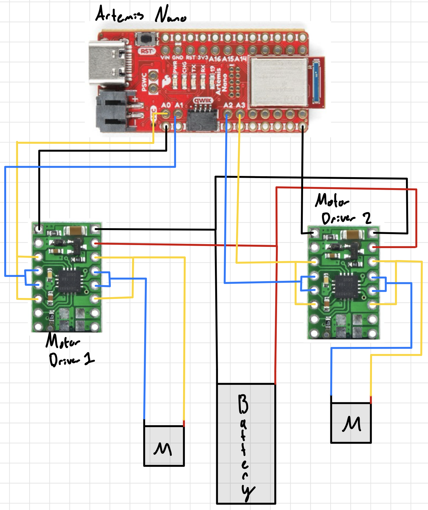
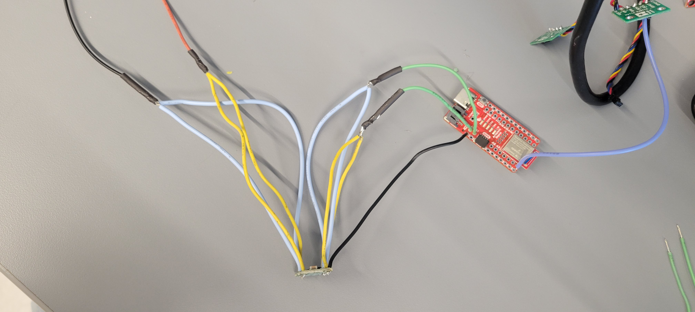
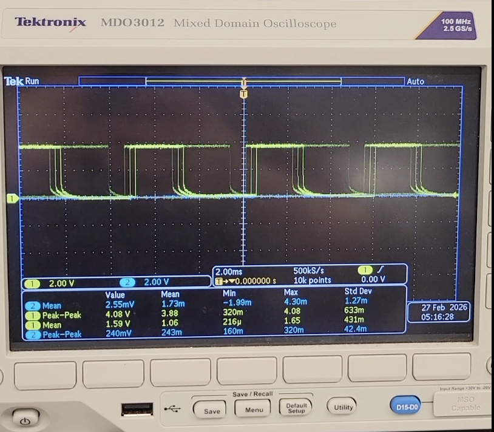
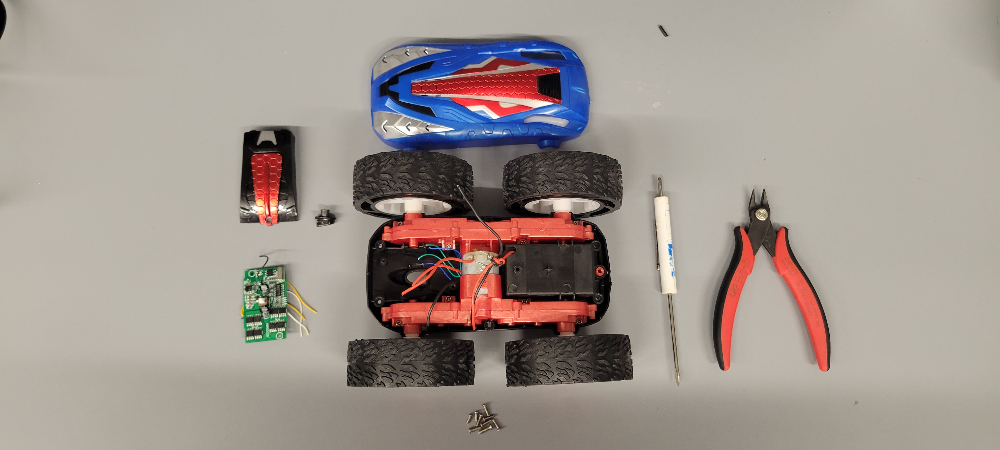
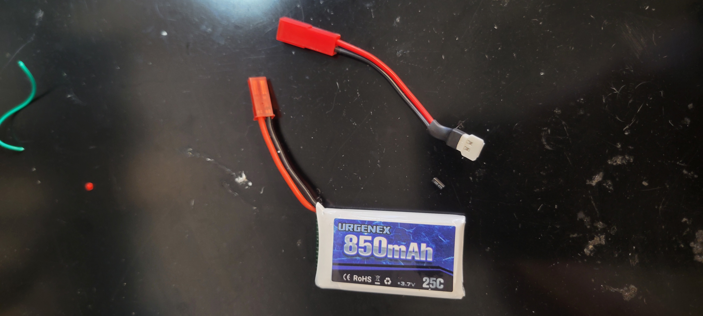
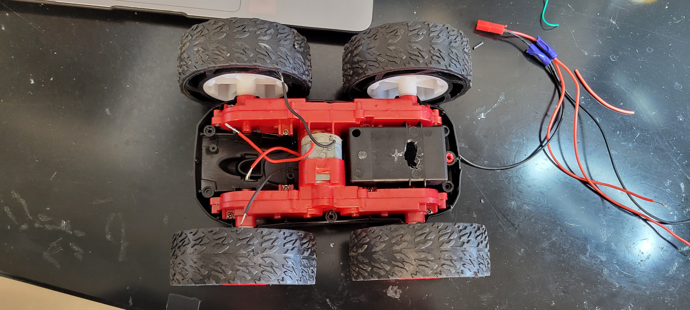
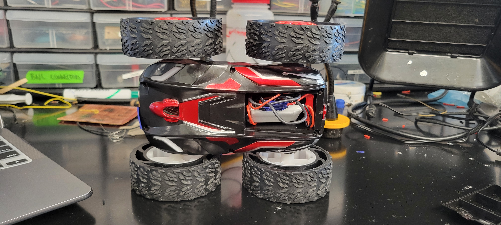

# Lab 4 Overview:
In this lab, I explore how to implement dual motor drivers and install them on my car fo full open loop control. All work was done on a 2020 M1 Macbook. 
```Final Wordcount: 987``` (Extra due to Graduate Tasks)

#### Pre-Lab
For this pre-lab, the first requirement was to read the [manual](https://www.pololu.com/product-info-merged/2130) and [datasheet](https://www.ti.com/general/docs/suppproductinfo.tsp?distId=10&gotoUrl=https%3A%2F%2Fwww.ti.com%2Flit%2Fgpn%2Fdrv8833) for the motor drivers. Beyond this, I also needed to decide what pins my drivers would use. Because my Lab 3's ```XSHUT``` was on  ```Pin 8```, I decided to keep the motor drivers' pins on the same side of the board. Thus, I used ```A0```, ```A1```, ```A2```, and ```A3```. Furthermore, for this car we are using two batteries due to the power draw between the motor/motor driver sets and the Artemis' sensors. If all devices were ran off the Artemis', the power draw would be too much and potentially reduce capabilities of some devices. Shown below is my wiring diagram for this setup:


#### Task 1: Motor Driver Setup
For this task, I wired and powered my motor driver following the aforementioned wiring guide. I used Blue/Yellow to correspond to the 1st and 2nd ```IN/OUT``` pins respectively, Black/Red for the ```OUT``` splitter, and Green for the ```IN``` board connections. This let me differentiate each one before and after the driver as shown:



When powering it, I set the voltage to ```3.7V``` to match the battery that would be connected.


#### Task 2: PWM Oscilliscope 
For this next task, I hooked up my motor driver to the Artemis' ```A0``` and ```A1``` & oscilliscope to generate PWM signals, using the given code and Arduino's ```analogWrite()```, as shown:
```c++
#define LEFT_A 0
#define LEFT_B 1

void setup() {
    pinMode(LEFT_A, OUTPUT);
    pinMode(LEFT_B, OUTPUT);
}

void loop{
analogWrite(LEFT_A, 255);
analogWrite(LEFT_B, 255);
}
```

<div style="text-align: center;">
  <video width="640" height="480" controls>
    <source src="/figures/4_lab/4_2a.mp4" type="video/mp4">
  </video>
</div>

Shown below is the static image of my PWM signal:


#### Task 3: Car Deconstruction

With the car now capable of pushing PWM signals, it was time to install everything. After unscrewing the blue side of the car and cutting the car LED's & driver board, I was ready to hookup/test my motor driver.



#### Task 4/5: Running the Car

I plugged my motor driver's ```A/BOUT``` pins to the motor and ran it. Shown in the video below, I could now run my car's wheels in both directions using the shown code on both external power supply and battery:

<div style="text-align: center;">
  <video width="640" height="480" controls>
    <source src="/figures/4_lab/4_3b.mp4" type="video/mp4">
  </video>
</div>

For running it on battery, I used the given connectors so I could easily connect/disconenct my battery for charging after splitting for both motor drivers:



Additionally, I drilled holes into the original battery carrier so I could hold it and its excess wire in it away from the other components:






#### Task 6/7: Dual Motor Running & Car Assembly
With the car now ready for installation, I soldered my 2nd motor driver together (```A2``` and ```A3``` on my board) and began testing out the car's bare minimum movement. Shown below is the "final" installation of the car (Note: the IMU/TOF sensors are very loosely installed, I plan to 3D print holders that connect to the existing screw holes so they can be more permanently attached). 


Now with everything installed, I ran a basic run/stop function using ```AnalogWrite()```'s on my Artemis and tested it:
```c++
#define LEFT_A 0
#define LEFT_B 1
#define RIGHT_A 3
#define RIGHT_B 2

void setup() {
    pinMode(LEFT_A, OUTPUT);
    pinMode(LEFT_B, OUTPUT);
    pinMode(RIGHT_A, OUTPUT);
    pinMode(RIGHT_B, OUTPUT);
    
}

void loop() {
    delay(10000);
    analogWrite(LEFT_A, 255);
    analogWrite(RIGHT_A, 255);
    delay(2000);

    analogWrite(LEFT_A, 0);
    analogWrite(RIGHT_A, 0);
}
```
Here is the video of it running:
<div style="text-align: center;">
  <video width="640" height="480" controls>
    <source src="/figures/4_lab/4_6b.mp4" type="video/mp4">
  </video>
</div>

As seen, it seems to veer left and also be very fast (I did apologize to the person's door I hit). This issue will be addressed in ```Task 9```

#### Task 8: PWM Lower Limit for Running
With the car now rinning, I wrote a small test program to iterate through PWM signals till it could overcome static friction using ```AnalogWrite()``` and a basic Serial For Loop:
```c++
void loop() {
    delay(10000);

    for (int i = 100; i<= 255; i++)
    {
    analogWrite(LEFT_A, i);
    Serial.print(i);
    Serial.println( "ON");
    delay(2000);

    analogWrite(LEFT_A, 0);
    }

}
```
Using this for both sides, I was able to find that my "cold-start" value for PWM was ```140``` and ```130``` for my right/left. This indicates that I have a higher friction in both and some interference. I may need to lubricate my internal gears & shorten my wires to cut down on this disturbance.

#### Task 9: Straight Line Calibration
To ensure it can move in a straight line I used a basic For Loop to test out lowering the weight of the left wheels. With this, I used PWM signals of ```145``` and ```130``` and was able to get this straight motion of 6ft:

<div style="text-align: center;">
  <video width="640" height="480" controls>
    <source src="/figures/4_lab/4_9a.mp4" type="video/mp4">
  </video>
</div>

Again, in the future it may be advantageous to reduce the friction of my wheels as well so that I can reduce the load on my motors to drive via sanding or taping.

#### Task 10: Open Loop Untethered Tricks
For the final part of the main section, I decided to do a basic 360 degree turn and straight so my car (the SB2000) could do its best Alysa Liu impression! Shown below is my open loop, untethered car running:

 <div style="text-align: center;">
  <video width="640" height="480" controls>
    <source src="/figures/4_lab/4_10a.mp4" type="video/mp4">
  </video>
</div>

Here is the code I used to generate this:
```c++

void loop() {
    Serial.println("~~~~~~~~~~~~~~~~~~~~~~~~`");
    Serial.println("STARTING");
    digitalWrite(LEFT_1, HIGH);
    analogWrite(LEFT_2, 20);
    digitalWrite(RIGHT_1, HIGH);
    analogWrite(RIGHT_1, 20);
    delay(500);

    digitalWrite(LEFT_1, HIGH);
    analogWrite(LEFT_2, 20);
    digitalWrite(RIGHT_1, HIGH);
    analogWrite(RIGHT_1, 20);
    delay(500);

    Serial.println("STOP");
}
```

Going into the future, I plan on implementing this into my full ```ble_env``` so that I can wirelessly call these functions. For now, this is sufficient so that I can test its capabilities easily.

#### Graduate Task: Timer for faster PWM Signal
After consulting the manual, I noted that the ```analogWrite()``` generates at a frequency of ```50kHz```. This is more than adequately fast for our motors given our sensing Hz is in the 10-100Hz range. However by adding timers for sending out PWM signals, you can greatly reduce noise and smoothen out the motor torque since you're not constantly pushing voltage/current. For example, using```delay()```, as seen in the next task, you can smooth out changes between speeds & better control your robot.

#### Graduate Task: Lowest PWM for motion
Using the inverse of ```Task 8```, I used a For Loop that ran the car at its fastest then incrementally slowed down:
```c++
void loop() {
    delay(10000);

    for (int i = 255; i>= 0; i--)
    {
    analogWrite(LEFT_A, 255);
    delay(100);
    analogWrite(LEFT_A, i);
    Serial.print(i);
    Serial.println("_ON");
    delay(2000);

    analogWrite(LEFT_A, 0);
    delay(500);
    }

}
```

With this, I acutally found my car could run at ```130``` and ```120``` for my right and left motions once jumpstarted. With this, I was able to run my motor slower than normal by winding it to ```255``` to overcome friction & run slower both forward & on-axis:
```c++
void loop() {

    digitalWrite(LEFT_1, HIGH);
    analogWrite(LEFT_2, 255);
    digitalWrite(RIGHT_1, HIGH);
    analogWrite(RIGHT_2, 255);
    delay(200);

    analogWrite(LEFT_2, 130);
    analogWrite(RIGHT_2, 120);
    digitalWrite(LEFT_1, LOW);
    digitalWrite(RIGHT_1, LOW);

    Serial.println("STOP");
}
```
 I was able to have the robot settle to its slowest speed in approcimately 0.2s, anything lower and the "wind-up" period would not be enough.


## Discussion
In this lab, I learned how to set-up/use the dual motor drivers & run my car. I had some difficulty with disturbance given my sensor placement & wire length, but some fine tuning and rewiring in the future should fix this!

Going forward, I feel more confident about both my soldering & sensor-use in the future as we implement Closed Loop control!

[back](./)

