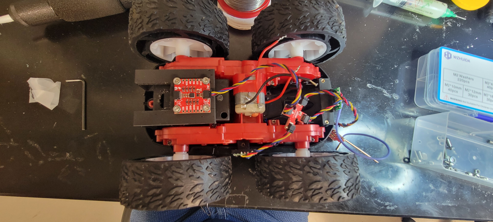
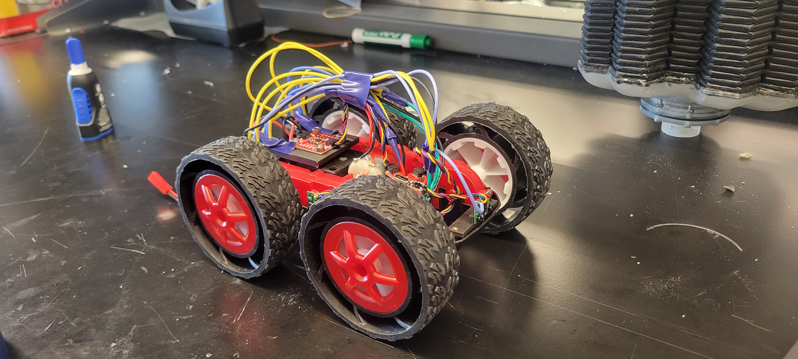
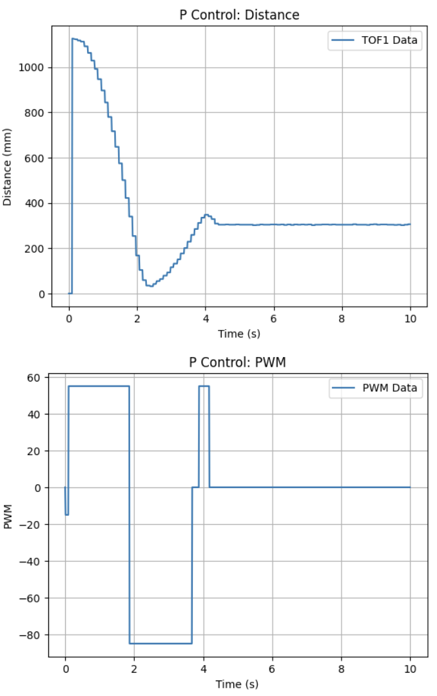
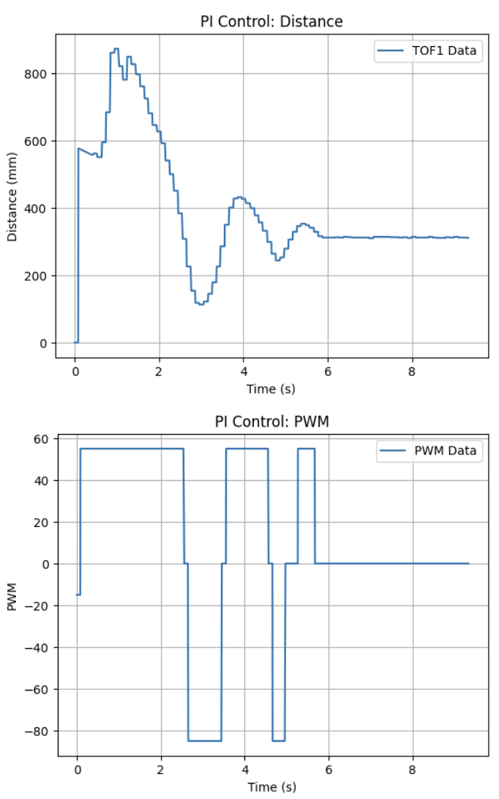
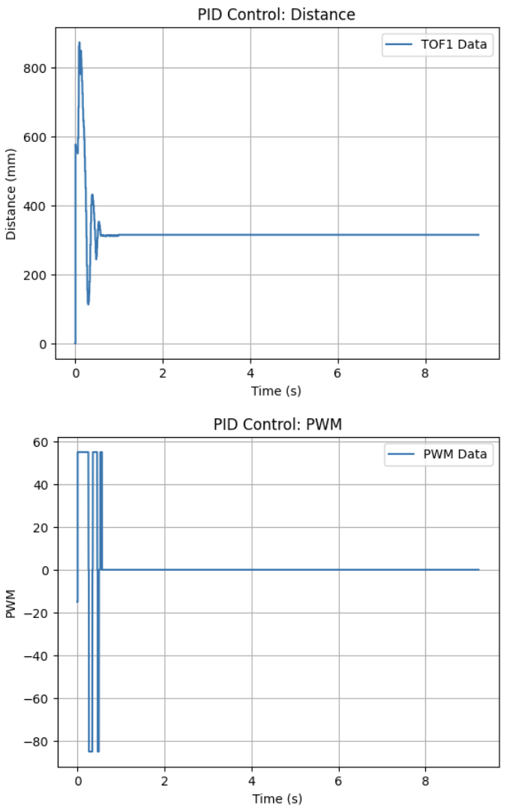

# Lab 5 Overview:
In this lab, I implement PID control in my robot system and analyze how position control can be achieved using distance feedback.

```Final Wordcount: 853``` (Extra due to Graduate Tasks)

#### Pre-Lab
The pre-lab focused on improving debugging and code robustness. I created helper functions for retrieving ToF/IMU data and parsing the goal distance, PID gains, and initial speed from BLE commands while rejecting invalid inputs. This structure simplified the control loop and improved maintainability.

```c++
void GET_IMU_TOF_DATA()
{
  //lab_4 TOF/IMU Code
}
void GET_GPIDS()
{
  bool success;
  success = robot_cmd.get_next_value(POS_goal);
  if (!success){
      Serial.println("ERROR: NOT A REAL distance");
      return;
  }

  success = robot_cmd.get_next_value(Kp);
  if (!success){
      Serial.println("ERROR: NOT A REAL KP");
      return;
  }
  success = robot_cmd.get_next_value(Ki);
  if (!success){
      Serial.println("ERROR: NOT A REAL KI");
      return;
  }
  success = robot_cmd.get_next_value(Kd);
  if (!success){
      Serial.println("ERROR: NOT A REAL KD");
      return;
  }
  success = robot_cmd.get_next_value(PWM);
  if (!success){
      Serial.println("ERROR: NOT A REAL PWM");
      return;
  }
}
```

An example BLE command used to send the control parameters is shown below:

```python
ble.send_command(CMD.POS_CTRL, "300|0.05|0.0|0.1|255")
```

I also added ```central.connected()``` as a condition in the control loop so the robot can be stopped by disabling Bluetooth communication if needed.

Additionally, I designed and 3D printed holders for the IMU and ToF sensors so they remain planar and normal to the ground respectively while keeping the wiring organized (now the SB3000):



My previous motor drivers were also replaced and the wiring was rebuilt as shown:



#### Task 1: TOF Sensor Frequency
From Lab 3, the ToF sensor frequency was measured at approximately 10.3 Hz. Because of this, PWM updates were only applied when new ToF measurements were available using a global boolean flag:

```c++
if (updatePWM)
{
  //Calls for updating PWM (See Task 2)
}
```

This ensured that control updates matched the sensor measurement rate.

#### Task 2: P Control
Using this structure, proportional position control was implemented where ```PWM = Kp * error``` and the error is the difference between the measured distance and the desired goal. Shown is my code implemntation of this:

```c++
while (central.connected() && ((millis() - start_time) < (unsigned long)max_samples && time_count < max_samples) ) 
{
  
  GET_IMU_TOF_DATA();

  POS_error = TOF_F_tracker[time_count] - POS_goal;
  POS_dt = (time_tracker[time_count] - time_tracker[time_count-1])*0.001;

  POS_P = Kp * POS_error;
  PWM = POS_P;

  if (abs(POS_error) < 10)
  {
    PWM = 0;
  }

  if (updatePWM)
  {
    if (PWM > 0)
    {
      if(PWM < 55){PWM = 55;}
      analogWrite(LEFT_1, PWM);
      analogWrite(RIGHT_1, PWM);
    }
    else if (PWM < 0)
    {
      if(PWM > -85){PWM = -85;}
      analogWrite(LEFT_2, abs(PWM));
      analogWrite(RIGHT_2, abs(PWM));
    }
    else
    {
      analogWrite(LEFT_1, 0);
      analogWrite(LEFT_2, 0);
      analogWrite(RIGHT_1, 0);
      analogWrite(RIGHT_2, 0);
    }
  }

  pwm_tracker[time_count] = PWM;
  prev_error = POS_error;
  time_count++;
}
```

Motor deadband was compensated by enforcing minimum PWM thresholds so that small signals still move the robot. A ±10 mm stopping condition was also added to prevent oscillation near the goal. Although the loop executes at ~280 Hz, PWM updates occur only when ToF data updates (~10.3 Hz).

After testing, a value of **Kp = 0.05** provided fast movement without slamming into the wall. The resulting behavior shows the oscillatory response characteristic of proportional control.

<div style="text-align: center;">
  <video width="640" height="480" controls>
    <source src="/figures/5_lab/5_2a.mp4" type="video/mp4">
  </video>
</div>



During testing, the ToF occasionally returned extreme readings (e.g., ```65620 mm```) in short mode. To prevent these from corrupting the error calculation, readings were capped at the sensor’s valid range of ```1360 mm``` (which can be lengthened later as needed):

```c++
if (TOF_F_tracker[time_count] > 1360){TOF_F_tracker[time_count] = 1360;}
```

#### Task 3: PI Control
An integral term was added to reduce steady-state error by accumulating past error values as shown in my implemented code:

```c++
POS_I_INT = POS_I_INT + POS_error*POS_dt;
POS_I = Ki * POS_I_INT;
PWM = POS_P + POS_I + POS_D;
```

Through experimentation, **Ki = 0.0005** produced stable behavior. Larger values caused the integral term to accumulate too quickly, resulting in aggressive motion toward the wall. With the integral term added, the system showed larger oscillation but improved settling as shown:

<div style="text-align: center;">
  <video width="640" height="480" controls>
    <source src="/figures/5_lab/5_3A.mp4" type="video/mp4">
  </video>
</div>



#### Task 4: PID Control
A derivative term was then implemented to damp oscillations and improve response speed by reacting to the rate of error change.

```c++
POS_D = Kd * (POS_error-prev_error)*dt;
PWM = POS_P + POS_I + POS_D;
```

Using the previously tuned gains and **Kd = 0.01**, the robot reached the target more quickly while reducing overshoot. The response was noticeably faster and more stable than the PI controller.

<div style="text-align: center;">
  <video width="640" height="480" controls>
    <source src="/figures/5_lab/5_4a.mp4" type="video/mp4">
  </video>
</div>



Overall, the PID controller provided the most robust and responsive performance and will serve as the baseline controller for future labs.

#### Task 5: Linear Extrapolation
To further improve responsiveness, linear extrapolation was used to estimate the robot’s distance between ToF updates. Using the last two measurements, a slope is calculated and used to estimate the current position so that control updates can run at the faster loop rate (~280 Hz):

```c++
slope = (TOF_F_tracker[time_count-1] - TOF_F_tracker[time_count-2]) /
(time_tracker[time_count-1] - time_tracker[time_count-2]);
dist = TOF_F_tracker[time_count-1] + slope * (POS_dt*1000);
```

Video results for this implementation are shown in the Graduate Task.

#### Graduate Task: Integrator Wind-up Protection
To prevent integrator wind-up, the integral term was only updated when the control output was not saturated:

```c++
if (abs(PWM) < 255) { POS_I_INT = POS_I_INT + POS_error*POS_dt; }
```

This prevents large accumulated error when disturbances occur, such as wheels catching on the floor or changes in surface friction. With this protection, the robot maintained stable behavior across different surfaces.

Tile:
<div style="text-align: center;">
  <video width="640" height="480" controls>
    <source src="/figures/5_lab/5_ga.mp4" type="video/mp4">
  </video>
</div>

Laminate:
<div style="text-align: center;">
  <video width="640" height="480" controls>
    <source src="/figures/5_lab/5_gc.mp4" type="video/mp4">
  </video>
</div>

## Discussion
In this lab I implemented and tuned PID control for position regulation using ToF distance feedback. After resolving issues with motor direction and invalid ToF readings, the final PID controller achieved fast and stable convergence. This control framework will serve as the baseline for future labs.

[back](./)