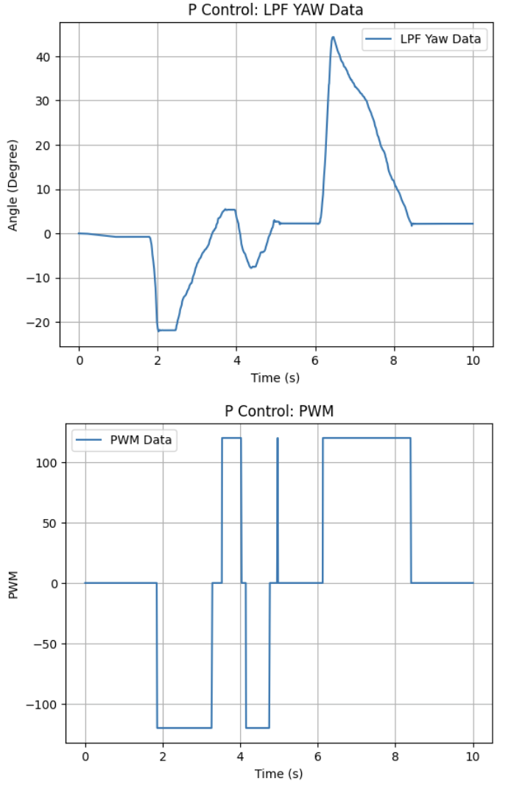
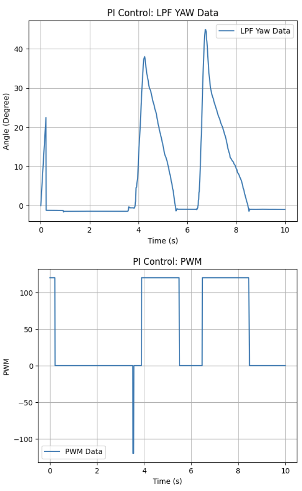

# Lab 6 Overview:
In this lab, I implement PID control in my robot system for Reorientation and analyze how rotation control can be achieved using an IMU gyroscope's feedback.

```Final Wordcount: 872``` (Extra due to Graduate Tasks)

#### Pre-Lab
The pre-lab focused on improving the bluetooth data pipeline implemented in previous labs (See ```Lab1/2```). For my implementation, I've been using the following prompt to set-up, connect, and read data over BLE.
```python
%load_ext autoreload
%autoreload 2

from ble import get_ble_controller
from base_ble import LOG
from cmd_types import CMD
import time
import numpy as np
import matplotlib.pyplot as plt

# Get ArtemisBLEController object
ble = get_ble_controller()

# Connect to the Artemis Device
ble.connect()
... (data arrays)

def notify_handler(uuid_str, byte_array):
    
    global time_stamps, done

    s = ble.bytearray_to_string(byte_array).strip()
    if not s:
        done = True
        return

    if s == "DONE":
        done = True
        return
    t_str, r_com, p_com, y_dmp, tof1, tof2, pwm = s.split(",")
    ... (appending data to arrays)

LOG.info("Initalized")
```

Similar to the previous labs, Bluetooth was used to send controller parameters and the desired position/orientation setpoint from the host computer to the robot. This allows rapid tuning of the controller without recompiling the firmware (i.e. tethering & untethering everytime to check values).

Commands are received using the ```GET_GPIDS()``` parser, which extracts the goal orientation and PID gains from the BLE message while rejecting invalid inputs before the main control loop starts. Because the goal is an internal variable, it can be updated at any point within the code or updated externally via BLE (See ```Task 5```):

```c++
void GET_GPIDS()
{
  bool success;
  success = robot_cmd.get_next_value(POS_goal);
  if (!success){
      Serial.println("ERROR: NOT A REAL distance");
      return;
  }

  success = robot_cmd.get_next_value(Kp);
  if (!success){
      Serial.println("ERROR: NOT A REAL KP");
      return;
  }
  success = robot_cmd.get_next_value(Ki);
  if (!success){
      Serial.println("ERROR: NOT A REAL KI");
      return;
  }
  success = robot_cmd.get_next_value(Kd);
  if (!success){
      Serial.println("ERROR: NOT A REAL KD");
      return;
  }
  success = robot_cmd.get_next_value(PWM);
  if (!success){
      Serial.println("ERROR: NOT A REAL PWM");
      return;
  }
}
```

An example BLE command used to send the orientation control parameters is shown below for a PI Controller:

```python
ble.send_command(CMD.ROT_CTRL, "0.0|0.5|0.075|0|255")
```

As in the previous lab, the controller runs while ```central.connected()``` is true so that Bluetooth communication remains active during testing and tuning, and such that if its disconnected the robot stops automatically.

```c++
GET_GPIDS()
while (central.connected() && ((millis() - start_time) < (unsigned long)max_samples && time_count < max_samples) ) 
{
  //Orientation Implementation
}
```

Finally, data is sent & received using the following c++ and python code:
```c++
for (int i = 0; i < time_count; i++) {
  tx_estring_value.clear();
  tx_estring_value.append((int)time_tracker[i]);
  tx_estring_value.append(",");

  tx_estring_value.append(com_roll_tracker[i]);  
  tx_estring_value.append(",");
  tx_estring_value.append(com_pitch_tracker[i]);
  tx_estring_value.append(",");
  tx_estring_value.append(LPF_yaw_tracker[i]);
  tx_estring_value.append(",");


  tx_estring_value.append(TOF_F_tracker[i]);  
  tx_estring_value.append(",");
  tx_estring_value.append(TOF_L_tracker[i]);
  tx_estring_value.append(",");

  tx_estring_value.append(pwm_tracker[i]); 

  tx_characteristic_string.writeValue(tx_estring_value.c_str());
  delay(5);
}
tx_estring_value.clear();
tx_estring_value.append("DONE");
tx_characteristic_string.writeValue(tx_estring_value.c_str());
```
```python
# Data Collector
#P Control
time_stamps.clear()
com_roll_data.clear()
com_pitch_data.clear()
tof1_data.clear()
tof2_data.clear()
pwm_data.clear()
dmp_yaw_data.clear()

ble.start_notify(ble.uuid["RX_STRING"], notify_handler)
LOG.info("Starting Command")
ble.send_command(CMD.ROT_CTRL, "0|0.5|0.0|0.0|255")

t0 = time.time()
done = False
while not done and (time.time() - t0) < 30.0:
    time.sleep(0.01)

ble.stop_notify(ble.uuid["RX_STRING"])
LOG.info("Data Collected")
```
This way, using the aforemntioned notification_handler, I can queue up data to be read and stored in my python environment for processing afterwards, or ignore this when wanting to do rapid changes (See ```Task 6```). Logged data includes:
- Time
- Roll (Complimentary Filter)
- Pitch (Complimentary Filter)
- Yaw (DMP & LPF)
- ToF sensor measurements
- Motor PWM command

All in all, this environment lets me keep the environment modular without much need for overhauls when tuning, receiving data, and experimenting.


#### Task 1: Orientation Measurement
The robot’s orientation for this lab was obtained using the quaternion output from the IMU’s DMP. These quaternions are converted into Euler yaw angles which are then used as the feedback signal for the controller. Shown below is this conversion used in my program as well as the checks to make sure data can be pulled:

```c++
if ((myICM.status == ICM_20948_Stat_Ok) || (myICM.status == ICM_20948_Stat_FIFOMoreDataAvail)) {
      if ((dmp_data.header & DMP_header_bitmap_Quat6) > 0) {
          updatePWM = true;
          q1 = ((double)dmp_data.Quat6.Data.Q1) / 1073741824.0; // Convert to double. Divide by 2^30
          q2 = ((double)dmp_data.Quat6.Data.Q2) / 1073741824.0; // Convert to double. Divide by 2^30
          q3 = ((double)dmp_data.Quat6.Data.Q3) / 1073741824.0; // Convert to double

          qw = sqrt(1.0 - ((q1 * q1) + (q2 * q2) + (q3 * q3)));; // See issue #145 - thank you @Gord1
          qx = q2;
          qy = q1;
          qz = -q3;

          t3 = +2.0 * (qw * qz + qx * qy);
          t4 = +1.0 - 2.0 * (qy * qy + qz * qz);
          dmp_yaw[1] = atan2(t3, t4) * 180.0 / PI;
      }
  }
```

If yaw were obtained purely by integrating gyroscope measurements, small biases in the sensor would accumulate over time and produce drift. The DMP mitigates this by performing onboard sensor fusion to lower the inherent drift (Hence my inclusion of it for this lab).

A low-pass filter was applied to attempt to reduce noise in the yaw signal before it was used by the controller (More on this in ```Task 4```):

```c++
LPF_yaw_tracker[time_count] = alpha*dmp_yaw[1] + (1-alpha)*dmp_yaw[0];
```

Alpha was found to be ~0.011 using the same previous methods detailed in ```Lab 2```.

Additionally, I used the following code to clamp my PWM signals to ensure that they dont go beyond what is physically possible:


#### Task 2: P Control
To control the robot’s orientation, I first implemented a basic P controller where the motor output drives the wheels in opposite directions so the robot rotates in place.

The control error is defined as the difference between the measured yaw and the desired goal orientation:

```c++
POS_error = LPF_yaw_tracker[time_count] - POS_goal;
```

Motor deadband was compensated by enforcing a minimum PWM magnitude so that small control signals still produce rotation and not causing the motor to stall:
```c++
if(abs(PWM) < 120){PWM = 120;}
```

This value is notably higher than the 55/85 PWM minimums for movement in the position lab (most likely due to the torquing motion requiring extra power to overcome friction). 

Additionally, I used an error space of +/- 0.5degrees as the goal-state to prevent oscillatory motions and keep the

Same as in the previous lab, P was defined as:

```c++
POS_P = Kp * POS_error;
```
where ```PWM = POS_P```. After some time spent tuning, I ultimately found a P value of ```0.5``` to work sufficiently. Shown below is the video & output for my P Controller:

<div style="text-align: center;">
  <video width="640" height="480" controls>
    <source src="/figures/6_lab/6_2a.mp4" type="video/mp4">
  </video>
</div>



While okay for returning close to the setpoint, P Contrl still had some steady-state error and oscillatory features that were less than desirable.

#### Task 3: PI Controller
Moving from this, I implemented a PI Controller. Following Lab 5's example, I used the integral definition of the DMP's LPF yaw to find my integral term:
```c++
... //(Kp Calculations)
POS_I_INT = POS_I_INT + POS_error*POS_dt;
POS_I = Ki * POS_I_INT;
PWM = POS_P + POS_I;
```

After some more work tuning, I found ```Ki=0.06``` to be a decent balance of driving force without significant overshoot or large lead time. Shown below are these results:

<div style="text-align: center;">
  <video width="640" height="480" controls>
    <source src="/figures/6_lab/6_3a.mp4" type="video/mp4">
  </video>
</div>



As mentioned in the pre-lab, the gyroscope is prone to drift (due to its bias in reading noise easily) which would have led to a large error-build up in doing this integration. Using the DMP with a LPF minimizes this affect by reducing noise in the gyroscope's output & fighting against high-frequency spikes peaking the I error term.

The gyroscope does have a limit on the maximum rotational velocity it can read at 23.9Hz, but by using the DMP we can bump this up to 102.3Hz, effectively half of my sampling rate for the system's controls. So while not as fast as the system, much faster than the gyroscope itself. The gyroscope itself can be configured to read up yo 1.1kHz, but the noise/drift will most likely accumulate faster and is not necessary given that our system only runs at ~203Hz. Thus I used the DMP for this lab.

#### Task 4: PID Controller
Given the relative success of the PI Controller, I moved to implement the D for a full PID controller. I used the following basic derivation for my D calculations:

```c++
... //(Kp/Ki Calculations)
POS_D = Kd * (POS_error-prev_error)/POS_dt;
PWM = POS_P + POS_I + POS_D;
```

However, when I implemented this above code with a range of Kd values I found the following issue (shown in this video):

<div style="text-align: center;">
  <video width="640" height="480" controls>
    <source src="/figures/6_lab/6_4a.mp4" type="video/mp4">
  </video>
</div>

If my ```Kd>0.3``` my system would be experience some derivative kick and begin oscillating/vibrating frequently in odd, jerk-y motions. However, for ```Kd<0.3``` the derivative would fall flat and no movement would occur as shown:

<div style="text-align: center;">
  <video width="640" height="480" controls>
    <source src="/figures/6_lab/6_4c.mp4" type="video/mp4">
  </video>
</div>

 I attempted tuning my LPF's alpha value, and the same issue would occur for varying Kd thresholds (Most likely due to my Kd pushing the system into instability). Thus, with this issue arising & my PI Controller working well, I've chosen to use PI Control for the foreseeable future.

 #### Task 5: Setpoint Change
 To demonstrate that my system can robustly react to different setpoints with no problem, I have compiled the video below showing the robot using 0°, 90°, and -90° as a setpoint rapidly:

 <div style="text-align: center;">
  <video width="640" height="480" controls>
    <source src="/figures/6_lab/6_5a.mp4" type="video/mp4">
  </video>
</div>
 

#### Graduate Task: Integrator Wind-up Protection
To prevent integrator wind-up, the integral term was only accumulated when the controller output was not saturated (as done in the previous lab):

```c++
if (abs(PWM) < 255) { POS_I_INT = POS_I_INT + POS_error*POS_dt; }
```

Without this protection, the integral term can accumulate excessively when the motor output is saturated (i.e. stalled). This can cause large overshoot once the controller regains control.

Shown below is the robot reorienting on various surfaces to demonstrate its capability (using ```Task 3's PI Controller```)
Tile:
<div style="text-align: center;">
  <video width="640" height="480" controls>
    <source src="/figures/6_lab/6_6a.mp4" type="video/mp4">
  </video>
</div>

Wood:
<div style="text-align: center;">
  <video width="640" height="480" controls>
    <source src="/figures/6_lab/6_6b.mp4" type="video/mp4">
  </video>
</div>

Laminate:
<div style="text-align: center;">
  <video width="640" height="480" controls>
    <source src="/figures/6_lab/6_6c.mp4" type="video/mp4">
  </video>
</div>


## Discussion
In this lab I implemented and tuned PID control for orientation regulation using IMU gyroscope feedback. After resolving issues with frayed wires shorting my motors (again) and DMP irregularities, I was able to get my code working appropriately. This control framework will be used in future labs to move around open spaces!

[back](./)