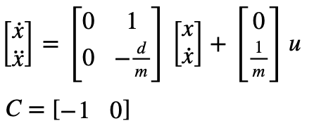
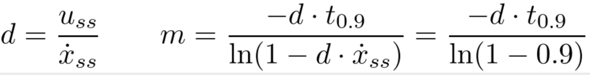
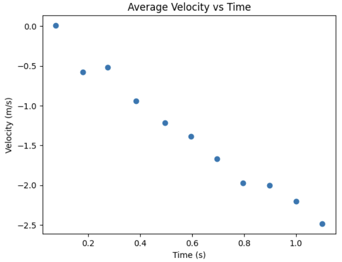
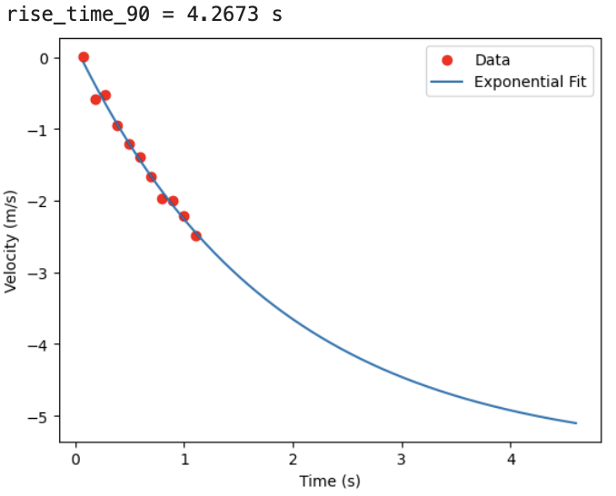
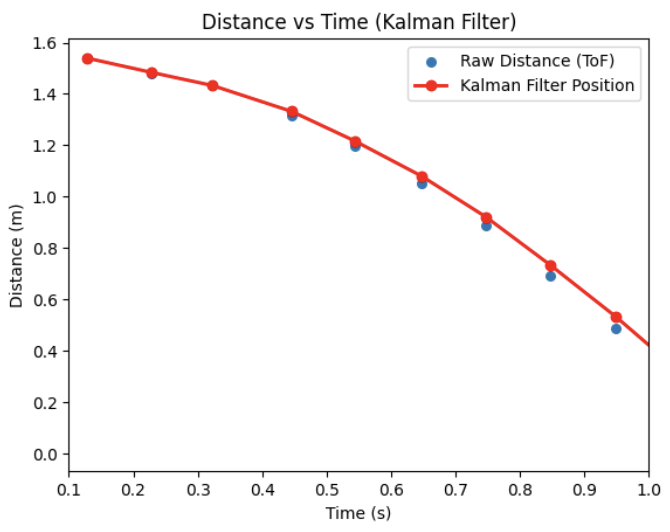
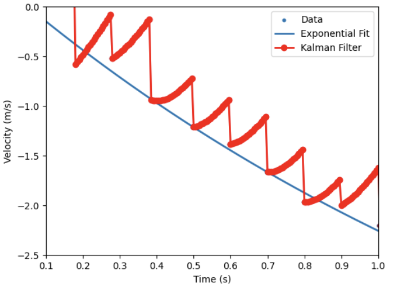
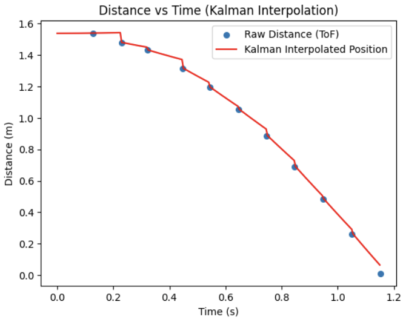
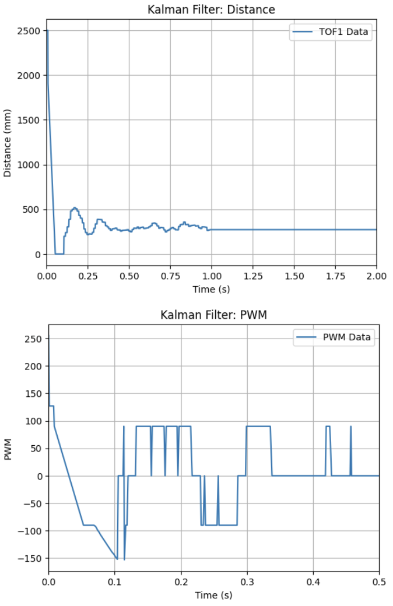

# Lab 7 Overview:
In this lab, I learned how to implement a Kalman Filter (KF) in order to drive my robot to a complete stop faster/earlier than ```Lab 5```'s attempt.

```Final Wordcount: 921```

#### Task 1: Estimate Drag & Momentum

In order to estimate drag and momentum from our system, I used the given state space representation & dynamics equations from lecture as shown:


Where drag & momentum can be found from the following (assuming there is a constant step input):


These equations allow us to approximate what m & d can be from a fitted exponential curve given that our ToF sensors cannot read far enough & testing areas are not long enough to reach a steady state speed.

Thus, for my system I chose a step input of 0.59u (where u=255 and is the steady-state constant control input for PWM) as this was the approximately maximum cruising velocity of my ```Lab 5``` tests. I wrote a new case into my Arduino environment ("SLAM") that runs at full speed until it reaches the wall with this step input as shown:
```c++
case SLAM{
... //Variable Setup
PWM=150;
analogWrite(LEFT_1, PWM);
analogWrite(RIGHT_1, PWM);

while (TOF_F_tracker[time_count-1] > 5.0 )
    {
    myICM.getAGMT();

    if (TOF_F.checkForDataReady())
    {
        TOF_F_tracker[time_count] = TOF_F.getDistance();
        if (TOF_F_tracker[time_count] > 2500){TOF_F_tracker[time_count] = 2500;}
    }
    else
    {
        TOF_F_tracker[time_count] = TOF_F_tracker[time_count-1];
    }

    Serial.println(TOF_F_tracker[time_count]);
    time_tracker[time_count] = millis();
    pwm_tracker[time_count] = PWM;
    time_count++;

    }

... //BLE Data Send-Out Code
}
break;
```
<div style="text-align: center;">
  <video width="640" height="480" controls>
    <source src="/figures/7_lab/7_1c.mp4" type="video/mp4">
  </video>
</div>

In order to gain accurate data, I ran this three times (saving each trial to a .csv file) in order to derive the average distance and velocity per ToF update (i.e. time-step of 10.3Hz). Shown below is the average velocity per time step for these trials where PWM=150 for all time steps:


As mentioned, in order to find mass (m) from drag (d) I needed to fit my data to an exponential curve. Using the provided code, I first loaded up scipy, my data and the function
```python
from scipy.optimize import curve_fit

df = pd.read_csv("Lab_7_Data/avg_velocity.csv")
time = df["time_s"].values
velocity = df["avg_velocity_m_s"].values

def exp_fnc(x, a, b, c):
    return a * np.exp(b * x) + c
```
From here, I could run my exponential curve and find the approriate rise time values and m/d function. Shown below is this code & output from an inital speedof 0.58u:
```python
exp_out, _ = curve_fit(exp_fnc, time, velocity, p0=(1, -1, 0))
a, b, c = exp_out

x_fit = np.linspace(time[0], time[-1] + 3.5, 1000)
y_fit = exp_fnc(x_fit, *exp_out)

t0 = time[0]
v0 = exp_fnc(t0, *exp_out)
vel_ss = c

vel_90 = c + 0.1*(v0-c)
t_90 = np.log((vel_90-c)/a)/b
d=(150/255)*c
m = (-d*t_90)/(np.log(1-0.9))
```


Thus, my drag(d) and mass(m) were found to be ```-0.3270 kg/s``` and ```-0.606kg``` respectively.

#### Task 2: Initialize KF (Python)

Now that I have my drag and mass, I could move on to actually using them in my KF from the system's dynamics (See Fig. 1). In python I set up the environment as such from the aforementioned dynamics (where c = [-1,0] as we'e observing the negative distance from car to goal & x = [Starting Distance, 0]): 
```python
... #Data Loading up from CSV
A = np.array([[0, 1],
              [0, -d/m]])

B = np.array([[0],
              [1/m]])

C = np.array([[-1, 0]])

x = np.array([[dist[0]],[0]])
```
With this, I could discretize my matrices where ```dt=0.09``` to approximate my ToF sampling rate of 10.3Hz and estabish my covariance matrices from the given code:
```python
n = 2
Ad = np.eye(n) + dt * A  
Bd = dt * B
u_ss = -1

sigma_P = .20 #Position
sigma_V = .50 #Velocity
sigma_S = .20 #Sensor

Sigma_u = np.array([
    [sigma_P**2, 0],
    [0, sigma_V**2]
])

Sigma_z = np.array([[sigma_S**2]])
```
Implementation/discussion of this can be found in ```Task 3```.

#### Task 3: Implement and test KF in Jupyter (Python)
Using the provided KF code shown below and loop requirements, I was able to implement a basic working KF for my data at the ToF sensor's frequency:
```python
def kalman(mu, sigma, u, y): #Provided
    mu_p = Ad.dot(mu) + Bd.dot(u)
    sigma_p = Ad.dot(sigma.dot(Ad.transpose())) + Sigma_u

    sigma_m = C.dot(sigma_p.dot(C.transpose())) + Sigma_z
    kkf_gain = sigma_p.dot(C.transpose().dot(np.linalg.inv(sigma_m)))

    y_m = y - C.dot(mu_p)
    mu = mu_p + kkf_gain.dot(y_m)
    sigma = (np.eye(2) - kkf_gain.dot(C)).dot(sigma_p)

    return mu, sigma

sigma = np.array([
    [10**2, 0],
    [0, 20**2]
])

kf_position = []

for i in range(len(time) - 1):
    x, sigma = kalman(x, sigma, u_ss, distance[i])
    kf_position.append(x[0, 0])
```
Shown below is the output from my testing, which was able to estimate the state very well:


For the position, velocity, and sensor variance I eventually settled on the values of ```0.2, 0.50, and 0.20``` respectively. I found that ball-parking, as mentioned, when looking at the data led me to covariance values that were much better than anticipated. Moreso, assuming that the velocity had a wider deviation (given the low sampling rate of the ToF led to a higher degree of accuracy in this simulation). Additionally, I found my value's balance balanced worked well as it somewhat trusted the sensor without overly relying on it. This meant it could be more impervious to sensor noise while minimizing errors that could arise form over-filtering.

#### Task 5: Speed it Up (Arduino)
While acceptable for this lab, I chose to take the KF a step further and have it run at my controller's speed (i.e. be capable of interpolation so that my car's dynamics could be more reactive). To do so, I modified my dt in the KF to run at ~200Hz as this is the speed of my PID controller:
```python
dt = 0.005 #200Hz
steps = np.arrange(0, t[-1], dt)

for i in steps:
    x, sigma = kalman(x, sigma, u_ss, distance[i], update)
   
    kf.append(x[0, 0])
```

Interestingly, my previous covariance values did not work correctly as shown below and led to this jagged formation. I had to increase my velocity magnitude by several magnitudes in order to have the system trust more of its speed (and thus in turn reduce this drift from not knowing its own speed)


After retuning my parameters to be ```0.2, 500, and 10``` for the position, velocity, and sensor covariance my at-speed interpolating KF implementation was able to reasnanly estimate my state as shown:



#### Task 4: Implement and test KF on Robot
With my KF now capable of running at-speed, I moved towards implementing it on my robot. Because the KF itself didnt change, only the coding language, I used the lab's examples for LinearAlgebra and rewrote the variables and filter into C++. Shown below are my basic state variables and covariance variables:

```c++
float d = -0.32696437850641535;  //kg/s
float m = -0.6059492076544491;   //kg

Matrix<2,2> A = {0, 1,
                 0, -d/m};

Matrix<2,1> B = {0, 1/m};

Matrix<1,2> C = {1, 0};

Matrix<2,2> Ad;
Matrix<2,1> Bd;

Matrix<2,1> x = {0, 0};
Matrix<2,2> sigma = {400, 0,
                     0, 100};

float sigma_P = 0.2;
float sigma_V = 500;
float sigma_S = 10;

Matrix<2,2> Sigma_u = {sigma_P*sigma_P, 0,
                       0, sigma_V*sigma_V};

Matrix<1,1> Sigma_z = {sigma_S*sigma_S};
float u_ss = -1;
int kf_i = 0;
```
From here, I created a function ```kalman()``` using these variables I could call during operations. With the KF function onw implemented, I modified ```Lab 5's``` POS_CTRL as shown to include the Kalman Filter and ran it.
```c++
... // GET_GPIDS() call & variable setup
 while (central.connected() && ((millis() - start_time) < (unsigned long)max_samples && time_count < max_samples) ) 
    {
    
    GET_IMU_TOF_DATA();

    POS_dt = (time_tracker[time_count] - time_tracker[time_count-1]) * 0.001;

    Ad = I + POS_dt * A;
    Bd = POS_dt * B;

    float measurement = TOF_F_tracker[time_count] * 0.001;
    bool update = true;
    if (time_count > 1)
    {
        float prev = TOF_F_tracker[time_count-1];
        float curr = TOF_F_tracker[time_count];
        update = (abs(curr - prev) > 5);
    }

    kalman(x, sigma, u_ss, measurement, update);
    float kf_distance = x(0,0) * 1000.0;
    POS_error = kf_distance - POS_goal;

    ...// PID Control & Data Send-Off
```
Like before, I handled the PID, Goal, and initial speed values from my python env so that I could very rapidly prototype (which was very helpful as my I value led to too many oscillations and issues originally). 

Thus, after spending time troublehshooting and recording, my Kalman Filter finally worked with my tuned PD Controller. Shown below is my working Kalman Filter, at speed, and its respective output for distance/PWM.
<div style="text-align: center;">
  <video width="640" height="480" controls>
    <source src="/figures/7_lab/7_4b.mp4" type="video/mp4">
  </video>
</div>



Important things to Note from my tuning for future readers:
- Because my KF relied more on the mode, I needed to increase my Kp value to give the controller a better "push" towards the goal and not be stuck in its dynamics 
- Ki, as mentioned led to some wildly variable results even at low values. I ultmately ditched it as my error was nominally low and withing accpetable bounds
- I initally had some issues with the robot moving forward some distance then stopping and rocking back and forth. This came down to not having enough trust in the sensors/environment and I needed to tune the proccess uncertainty variables more effectively
- My measurement uncertainty also had a very tight band of acceptable values. Too high and the drift would slam it into the wall, and too low made made it move irrationally as it became subject to noise.

#### Task Graduate: N/A
None, thanks for letting us off the hook!

## Discussion
In this lab I implemented a Kalman Filter and tuned a PD control for better speed control. After spending some time retuning my PD controller to work with the KF, I was able to fully get it to work. I look forward to using this KF into the future as we move towards more complicated movement tasks (this was super cool to implement and get working!).

[back](./)