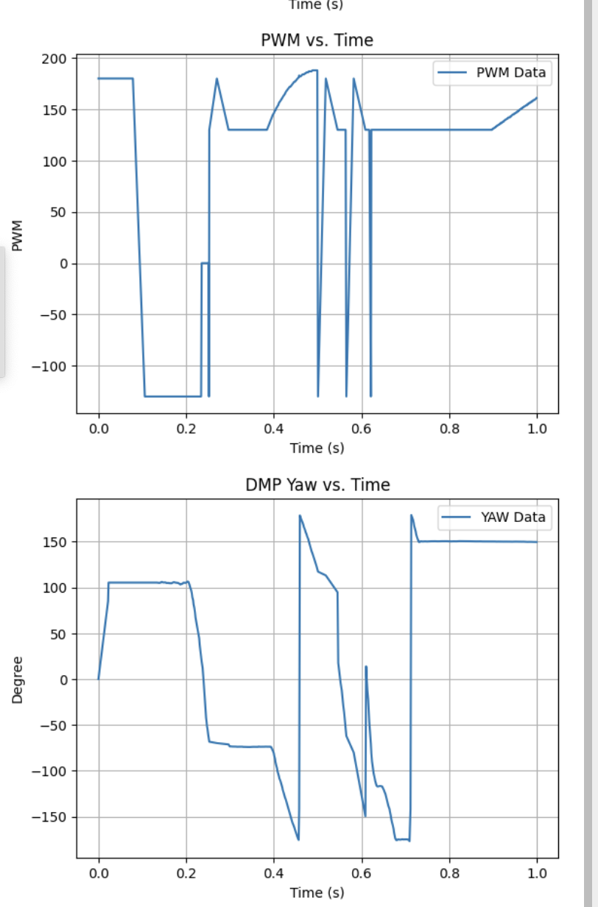
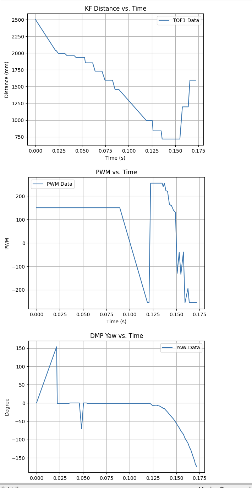
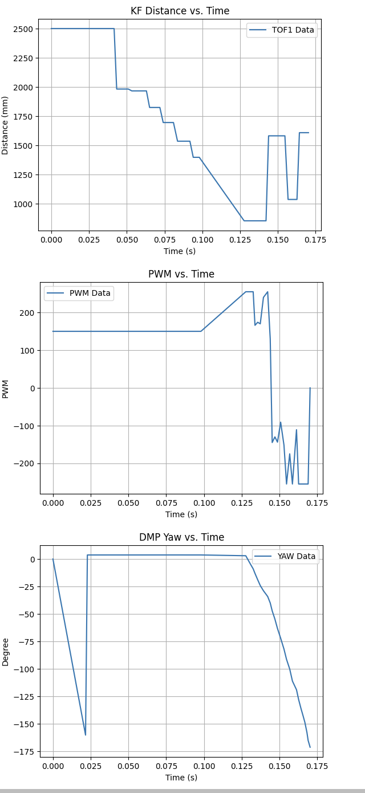
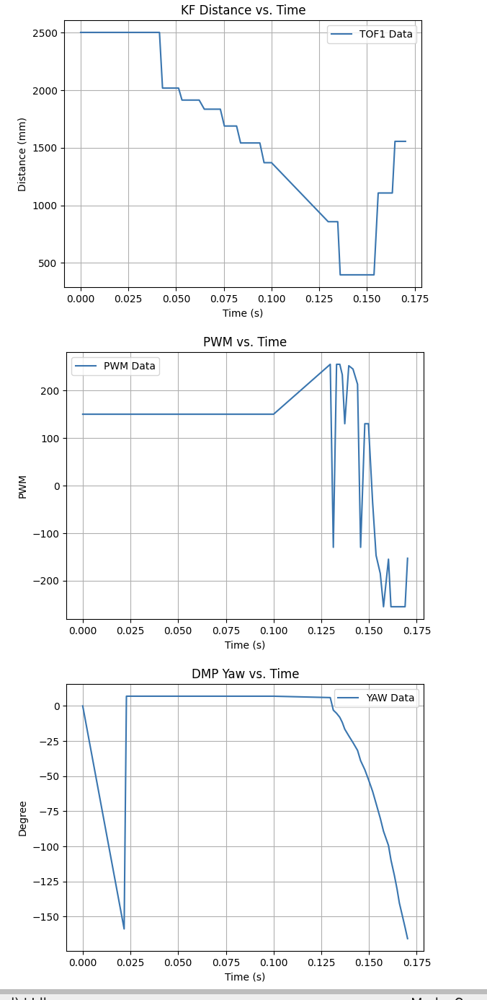
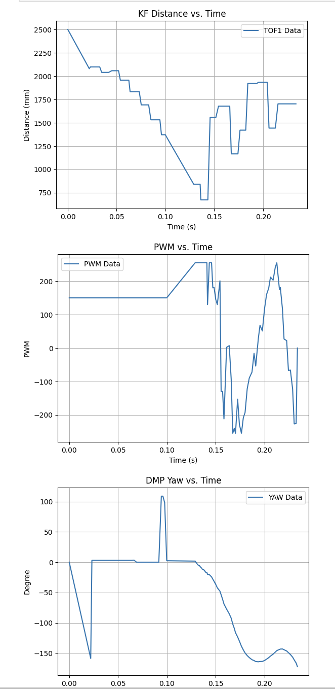

# Lab 7 Overview:
In this lab, I learned how to complete a full stunt using everything I've learned in Lab's 1-6!

(One week extension used - One remains)

```Final Wordcount: 678```

#### Task B: Drift
For this lab, I decided to go with the the ```Drift``` option in tasks. I believed it would be "easier" (famous last words) to implement and required the least modifcations to my car. 

On top of the work below, I also removed Lab 1-4's cases & tracked variables to free up space/memory in my Artemis. This let me prototype more efficiently and reduce the bloat in my system. Additioanlly I used the same framework outlined in ```Lab 7``` with ToF, Motor, variable, and BLE establishment.

To start off with this task, I divided it into two sections for implementation. For the first one, I knew I needed to move forward fast towards my wall and be able to act accordingly once within distance. Pulling from Lab 5's ```POS_CTRL```, I implemented a basic check with my TOF's extrapolation algorithm to determine if I was within a passed goal to my wall. 

Side note: I chose to forgo using ```Lab 7's``` Kalman due to its inconsistencies between trials. Sometime's it worked very well and other times it would kick down/up randomly (which is most likely due to my implementaiton and some speed differences, but I ignored this to use something more managgeable).

Shown below is implementation with a ```turning``` boolean to check if I needed to start the second section:
```c++
case DRIFT{
//... Variable Declarations

while (central.connected() && (millis() - start_time) < (unsigned long)max_samples && time_count < max_samples)
{
    GET_IMU_TOF_DATA();

    POS_dt = (time_tracker[time_count] - time_tracker[time_count-1]) * 0.001;
    if (POS_dt <= 0) POS_dt = 0.001;

    if (!turning)
    {
        float distance = TOF_F_tracker[time_count];

        if (updatePWM)
        {
            analogWrite(LEFT_1, fwd_pwm);
            analogWrite(RIGHT_1, fwd_pwm);
            analogWrite(LEFT_2, 0);
            analogWrite(RIGHT_2, 0);
        }
        pwm_tracker[time_count] = fwd_pwm;

        if (distance > 50 && distance < turn_threshold) ? trigger_count++; : trigger_count = 0;

        if (trigger_count > 3)
        {
            turning = true;
            yaw_offset = LPF_yaw_tracker[time_count] - 180.0;
            yaw_goal = 0.0;

            POS_I_INT = 0.0;
            prev_error = 0.0;

            analogWrite(LEFT_1, 0);
            analogWrite(RIGHT_1, 0);
            analogWrite(LEFT_2, 0);
            analogWrite(RIGHT_2, 0);
        }
    }
    //... More Implementation
            }
break;
}
// Lab 5 Extrapolation Code
```

I also knew I wanted to ignore noise as much as possible. To do so, I kept my ```Lab 5's``` Low Pass Filter with an added debounce trigger (because my ToF kept glitching and reading both 0 and max randomly) to ensure my signal would be true when the condition was met. Additionally, I chose 1500mm (1.5m) as my goal distance due to my ToF sensors poor readings (most likely due to repeated wall bashings).

Now that my car was able to successfully reach a goal rapidly, I needed to imlement my rapid turn. To do so, I adopted ```Lab 6's``` ROT_CTRL framework to quickly drift the car. Pulling the DMP yaw as my observer with a LPF (see ```Lab 6```) and integral windup protector, I used the following as my implementation:

```c++
case DRIFT{
//... Variable Declarations

while (central.connected() && (millis() - start_time) < (unsigned long)max_samples && time_count < max_samples)
{
    //... Go straight code
    else
    {
        float adjusted_yaw = LPF_yaw_tracker[time_count] - yaw_offset;
        adjusted_yaw = atan2(sin(adjusted_yaw * PI / 180.0), cos(adjusted_yaw * PI / 180.0)) * 180.0 / PI;
        POS_error = adjusted_yaw - yaw_goal;
   
        POS_P = Kp * POS_error;

        if (abs(PWM) < 255)
        {
            POS_I_INT += POS_error * POS_dt;
        }

        POS_I = Ki * POS_I_INT;
        POS_D = Kd * (POS_error - prev_error) / POS_dt;

        PWM = POS_P + POS_I + POS_D;
        PWM = constrain(PWM, -255, 255);

        if (abs(POS_error) < 10)
        {
            PWM = 0;
            POS_I_INT = 0;

            analogWrite(LEFT_1, 0);
            analogWrite(LEFT_2, 0);
            analogWrite(RIGHT_1, 0);
            analogWrite(RIGHT_2, 0);
            delay(5);

            prev_error = 0.0;
            time_count++;
            break;
        }

        if (updatePWM)
        {
            if (PWM > 0)
            {
                if (abs(POS_error) > 120 && PWM < 130) PWM = 130;
                analogWrite(LEFT_1, PWM);
                analogWrite(RIGHT_2, PWM);
                analogWrite(LEFT_2, 0);
                analogWrite(RIGHT_1, 0);
            }
            else if (PWM < 0)
            {
                if (abs(POS_error) > 120 && PWM > -130) PWM = -130;
                analogWrite(LEFT_2, abs(PWM));
                analogWrite(RIGHT_1, abs(PWM));
                analogWrite(LEFT_1, 0);
                analogWrite(RIGHT_2, 0);
            }
            else
            {
                analogWrite(LEFT_1, 0);
                analogWrite(LEFT_2, 0);
                analogWrite(RIGHT_1, 0);
                analogWrite(RIGHT_2, 0);
            }
        }
        pwm_tracker[time_count] = PWM;
        prev_error = POS_error;
    }
}

break;
}
```

Now with the basic framework established, I moved to tuning. This took more time and I expected, due to two main errors. 

The first being the PI wrapping for the goal, because my ```Lab 6``` code had a settling goal of 0 my original code led to huge PWM spikes when my code wrapped around PI as I didn't originally account for this and led to weird spinning behaviors.

The second issue was that my original code had a base PWM of 130 as this was the deadband to overcome friction from a stop. This worked then, but because my robot was already had some momentum keeping this led to huge overshoot that would kick my robot "around" pi and lead to the aforementioned problem. Shown below is the issue exemplified through the video and PWM/Yaw sawtooth data:


<div style="text-align: center;">
  <video width="640" height="480" controls>
    <source src="/figures/8_lab/8_d0.mp4" type="video/mp4">
  </video>
</div>

To fix this, as shown above I correctly wrapped my goal using ```atan()```, implemented a staggered PWM deadband while it was settling, as well as heavily tuned my PID in order to prevent serious overshoot while keeping the movement zippy (P=3.15, I=0.01, D=1.0 where initial speed = 0.73u). After much time tuning, I finally had some decent results that were able to rapidly approach, turn/drift, then kick back!

```Run 1:```

<div style="text-align: center;">
  <video width="640" height="480" controls>
    <source src="/figures/8_lab/8_d1.mp4" type="video/mp4">
  </video>
</div>

```Run 2:```

<div style="text-align: center;">
  <video width="640" height="480" controls>
    <source src="/figures/8_lab/8_d2.mp4" type="video/mp4">
  </video>
</div>

```Run 3:```

<div style="text-align: center;">
  <video width="640" height="480" controls>
    <source src="/figures/8_lab/8_d3.mp4" type="video/mp4">
  </video>
</div>

While this took much work, I was very happy with how zippy this was overall and how well it could settle towards a flipped goal :]

#### Task Graduate: N/A
None, thanks for letting us off the hook!

#### Extras: Bloopers & Cool Stunts
While filming, I accidentally recorded a double drift (with some decently funny commentary so please turn on sound). Hope this is as cool/funny as my lab mates and I thought it was!


<div style="text-align: center;">
  <video width="640" height="480" controls>
    <source src="/figures/8_lab/8_e1.mp4" type="video/mp4">
  </video>
</div>

## Discussion
In this lab I learned how to pull everything together to create a cool drift stunt for my robot. While both difficult and intense to get it in a tuned complete state, it was very rewarding to finally get it working and see my robot execute its task so quickly. I look forward to doing more cool tasks in the future!

[back](./)