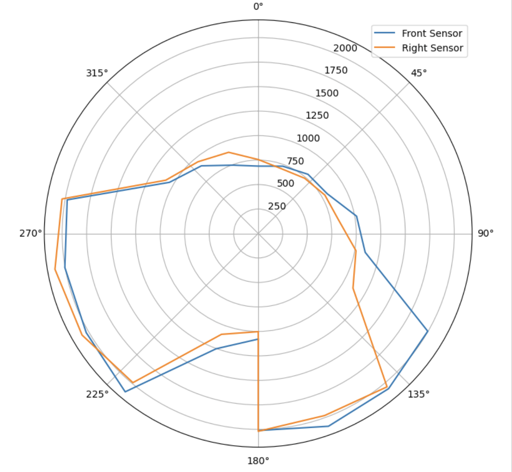
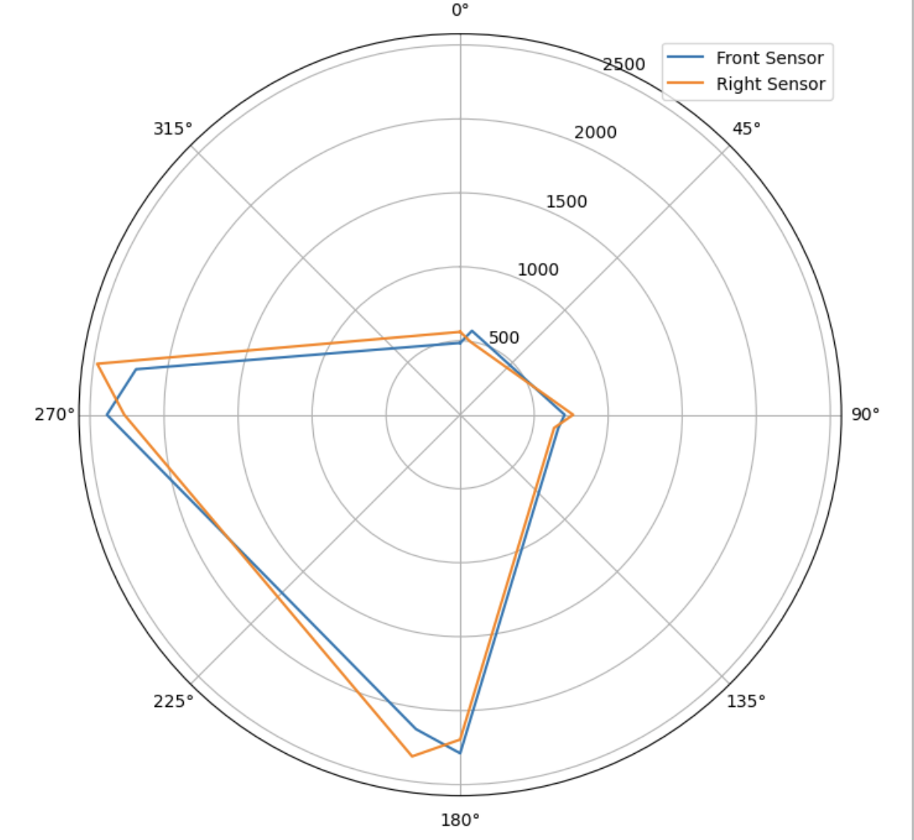
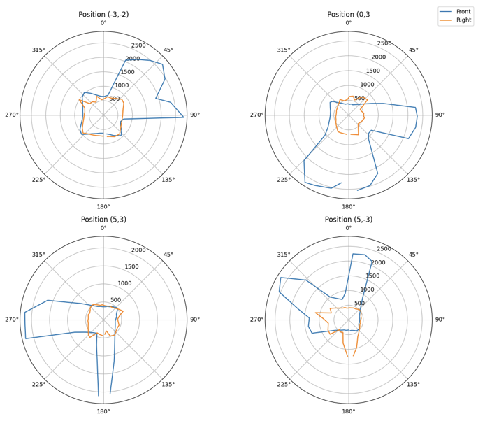
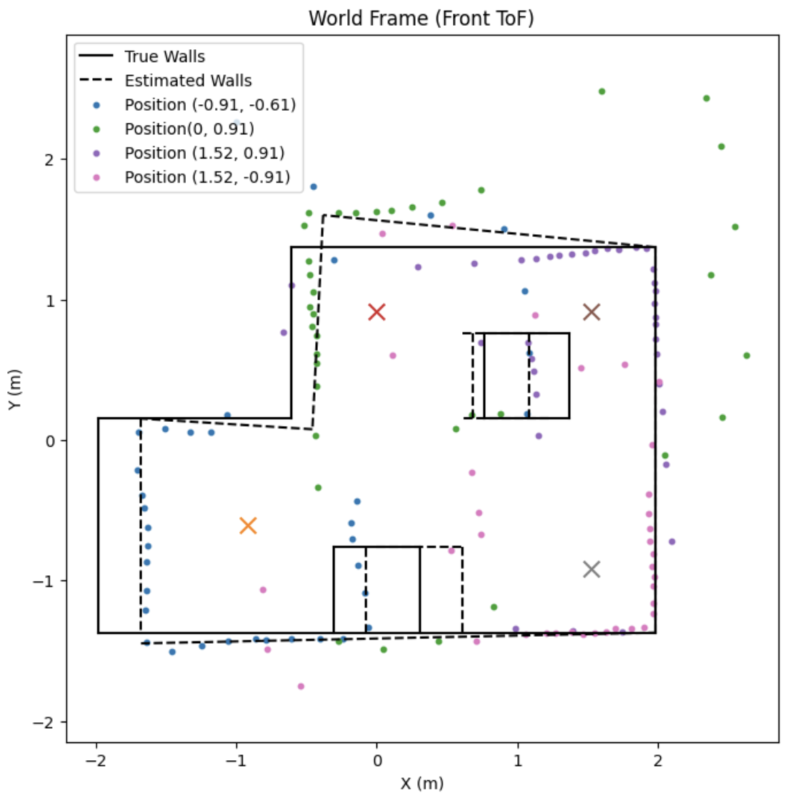

# Lab 9 Overview:
In this lab, I learned how to map out a room using ToF sensors and PID orientation control and analyze how well it performs compared to ground truths.

```Final Wordcount: 924```

#### Control: Option 2 (Orientation Control)
For this lab, I decided to go with the the ```Orientation Control``` option due to my ```Lab 8```'s responsiveness to PID movements in space. In order to do so, I slightly modified my ```Lab 6 ROT_CTRL``` orientation control to run several times in a row. To facilitate this, I knew I needed to make several changes around the PID controller to ensure rapid control.

The first of these changes was to my ```GET_TOF_IMU``` function. Becasuse I knew I needed more data to collect during each turn I removed out the Gyroscope's roll/pitch calculations and data tracker as shown:
```c++
void GET_IMU_TOF_DATA()
{
  myICM.getAGMT();
  myICM.readDMPdataFromFIFO(&dmp_data);

  if ((myICM.status == ICM_20948_Stat_Ok) || (myICM.status == ICM_20948_Stat_FIFOMoreDataAvail)) {
      if ((dmp_data.header & DMP_header_bitmap_Quat6) > 0) {
          updatePWMTurn = true;
          q1 = ((double)dmp_data.Quat6.Data.Q1) / 1073741824.0; // Convert to double. Divide by 2^30
          q2 = ((double)dmp_data.Quat6.Data.Q2) / 1073741824.0; // Convert to double. Divide by 2^30
          q3 = ((double)dmp_data.Quat6.Data.Q3) / 1073741824.0; // Convert to double. Divide by 2^30

          qw = sqrt(1.0 - ((q1 * q1) + (q2 * q2) + (q3 * q3)));; // See issue #145 - thank you @Gord1
          qx = q2;
          qy = q1;
          qz = -q3;

          t3 = +2.0 * (qw * qz + qx * qy);
          t4 = +1.0 - 2.0 * (qy * qy + qz * qz);
          dmp_yaw[1] = atan2(t3, t4) * 180.0 / PI;
      }
  }
  else{
    updatePWMTurn = false;
  }


  LPF_yaw_tracker[time_count] = 0.5*dmp_yaw[1] + (1-0.5)*dmp_yaw[0];

  time_tracker[time_count] = millis();
  dmp_yaw[0] = dmp_yaw[1];

  
}
```
This reduced my storage considerably and let me to store up to 45 seconds of yaw, TOF, and time data (Effectively quadrupling my current storage). Additionally, I removed the ToF checks in this quadrant as I knew I wanted to only log ToF data after the robot settled so I wouldn't log noisy/incorrect data.

Following this, I moved towards the reorienting approach for the robot with a case called ```MAP```. Using a basic approach, I passed ```POS_Goal``` as the target angle per turn for my robot wherein a For Loop itereated through the number of steps that would be necessary to reach this as shown:

```c++
case MAP:
{
    unsigned long start_time = millis();
    time_count = 0;

    GET_GPIDS();
    float angle_step = POS_goal;
    int num_steps = (int)(360.0 / angle_step);

    TOF_F.startRanging();
    TOF_F.setDistanceModeLong();
    TOF_L.startRanging();
    TOF_L.setDistanceModeLong();
    myICM.resetDMP();
    delay(200);
    myICM.resetFIFO();
    delay(50);

    for (int step = 0; step <= num_steps && central.connected(); step++)
    {   
      //Reorientation PID
    }
}
```
Additionally from using the DMP yaw's PID control previously, I knew I was going to encounter issues with rolling over from +pi to -pi as well as the DMP having a backlog buildup of info from the FIFO. Additionally, it was sometimes hard to recognize when the robot was done with its task. To work around this, I implemented three changes:
1. Rather than set the robot's initial yaw at 0 degrees and offsetting & wrapping it, after settling I forced a reset of the DMP. This meant every yaw was from [0-angle) regardless of reorientation in the global frame.

2. Because this approach of resetting could flood the DMP with a backlog of readings, I additionally reset its FIFO before PID to ensure the device was "fresh".

3. I included a Flash on the robot to ensure that I could confirm when it finished each rotation (and validate that its proposed turn was correct). 

Shown below are the respective code for these:

```c++
//... For Loop wrapping
while (central.connected() && (millis() - turn_start) < 5000 && time_count < max_samples)
  {
    //Lab 6/8 PID Implementation
  }

  analogWrite(LEFT_1, 0); analogWrite(LEFT_2, 0);
  analogWrite(RIGHT_1, 0); analogWrite(RIGHT_2, 0);

  digitalWrite(LED_BUILTIN, HIGH);
  myICM.resetDMP();
  delay(200);
  myICM.resetFIFO();
  delay(200);

  dmp_yaw[0] = 0.0;
  dmp_yaw[1] = 0.0;
  updatePWMTurn = false;

  digitalWrite(LED_BUILTIN, LOW);
  pwm_tracker[time_count] = 0;
  time_tracker[time_count] = millis();
  TOF_F_tracker[time_count] = TOF_F.getDistance();
  TOF_L_tracker[time_count] = TOF_L.getDistance();
  time_count++;
  delay(2000);

```
Given the system's errors(see next section) during movement, I noted a slight 1"-1.5" drift whenever the wheels dropped too low in PWM between measurements. Because of this, I would expect taking measurements in a 4x4m empty room to see drift akin to this along the outer walls

#### Read out Distances

With this implemented and ready, I moved towards the testing. After spending some retuning my system (my previous deadband was too high for slow movements, so I added tape to my wheels to lower the friction) I eventually settled on a PID value of ```0.5, 0.06, and 0.025``` respectively. Shown below is my robot turning with 25 degree increments using the aforementioned code & PID values:

<div style="text-align: center;">
  <video width="640" height="480" controls>
    <source src="/figures/9_lab/9_a1.mp4" type="video/mp4">
  </video>
</div>

And here are the polar outputs from that turn on the lab table:



After validitaing this movement and confirming its capabilities, I moved to test in the lab environment. Shown below is the only data I got from having my car move in 90 degree increments at (5,3):

<div style="text-align: center;">
  <video width="640" height="480" controls>
    <source src="/figures/9_lab/9_a2.mp4" type="video/mp4">
  </video>
</div>



Following this test, however, my robot completely broke and wouldn't respond to basic  prompts to turn the wheels (high pitched squealing sounds & gears grinded; which as one would guess was very dissapointing given the robots proof of capabilities prior). 

To circumvent this for the sake of this lab, I was given permission to use Maia Hirsch's data from her car while my robot is fixed in preparation for Lab 11/12. The remainder of the lab's post processing was done using this data (all work was done independently of one another).

#### Merge and Plot your Readings
Taking the data and using the matplotlib polar plotter, you can see below what the radial data from each location looked like:



While the front sensor was nominally correct, the right sensor seemed to have a constant radial readout (most likely due to a downward-facing ToF reading the floor). Because of this, the right sensor will be ignored for the creation of the map to keep it more accurate.

#### Convert to Line-Based Map
Finally, to convert between the given polar coordinates and a world frame I created a Transformation Matrices to do so. Pulling from ```Lecture 2```, I defined my matrix as thus where T is the homogenous transformation matrices and P is the conversion from the ToF's frame to the global frame via T:

$$
T(\theta, x_r, y_r) =
\begin{bmatrix}
\cos\theta & -\sin\theta & x_r \\
\sin\theta & \cos\theta  & y_r \\
0          & 0           & 1
\end{bmatrix}
$$

$$
P_{\text{world}} =
T \cdot
\begin{bmatrix}
d + \text{0.09} \\
0 \\
1
\end{bmatrix}
$$

Using this conversion for the front sensor, I was able to generate this view of the world and the estimated position of the wall:



I believe that with some retuning of the ToF control (i.e. LPF) and several reruns this data set could be more accurate to the world environment. Much of the noise came from lowered ToF sensors and inaccurate readings (hence several points are short or nowhere near the ground truth). Reruns taking more data with averages would make this system more accurately match the true environment.

## Discussion
In this lab, I learned how to reapply what I learned in ```Lab 6-8``` to map out a room in space while calling back to Local/Global Frame mapping from ```Lecture 2```. While I had the aforementioned issues wth my car breaking, I still was able to perform the majority of the lab outside of the data collection. I look forward to using this again in Lab 11/12 for Localization movements!

#### References
As mentioned, I use Maia Hirsh's data because my car broke right before data collection. All work prior and subsequent to data collection is my own work including the transformation matrices, plotting, and interpretation.

[back](./)